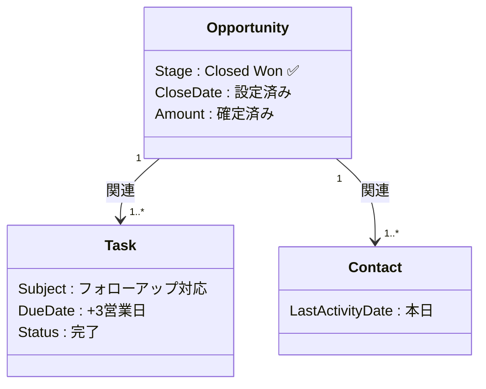

# 業務処理フロー統合設計書｜商談クローズ〜成約後対応

---

## 基本情報

| 項目 | 内容 |
|-----|------|
| 業務名 | 商談クローズ〜成約後対応フロー |
| 対象オブジェクト | Opportunity（商談）、Task（ToDo）、Contact（取引先責任者） |
| 最終更新日 | 2026-03-13 |
| 作成者 | — |
| バージョン | v1.0 |

---

## 処理フロー統合図

> 凡例：`🧑 手動操作`　`⚙️ 自動処理（フロー）`　`📧 自動処理（メール）`　`✅ 完了状態`　`❌ エラー`

```mermaid
flowchart TD
    START([🚀 開始：商談のクローズ判断]) --> A

    subgraph 営業担当の操作
        A[🧑 Opportunityレコードを開く]
        A --> B[🧑 ステージを\n「Closed Won」に変更]
        B --> C[🧑 「保存」ボタンをクリック]
    end

    C --> D{Salesforceが\n自動判定}

    subgraph 自動処理①：成約通知フロー
        D -->|Closed Won| E[⚙️ レコードトリガーフロー起動\n（成約通知フロー）]
        E --> F[⚙️ 関連Contactを取得]
        F --> G[⚙️ Contactに\nToDoレコードを作成\n期限：3営業日後]
        G --> H[📧 担当者へメール通知送信\n件名：「成約：〇〇様」]
    end

    H --> I{メール送信\n成功？}
    I -->|成功| J[✅ 処理完了\nOpportunity：Closed Won\nToDo：作成済み]
    I -->|失敗| K[❌ エラーログ記録\n管理者へSlack通知]

    D -->|Closed Lost| L[⚙️ レコードトリガーフロー起動\n（失注通知フロー）]
    L --> M[⚙️ 上長へ失注レポートメール送信]
    M --> N[✅ 処理完了\nOpportunity：Closed Lost]

    subgraph 営業担当の事後対応
        J --> O[🧑 ToDoを確認]
        O --> P[🧑 お礼・フォローアップの\n顧客連絡を実施]
        P --> Q[🧑 ToDoを「完了」にマーク]
    end

    Q --> END([🏁 終了：一連のクローズ対応完了])
    K --> END2([🏁 終了：要エラー対応])
```

---

## 自動処理一覧

| # | 処理名 | 種別 | 発火条件 | 処理内容 | 対象オブジェクト |
|---|-------|-----|---------|--------|--------------|
| 1 | 成約通知フロー | レコードトリガーフロー | Opportunity.Stage = "Closed Won" に変更時 | 関連ContactにToDoを作成（期限：3営業日後） | Opportunity → Task |
| 2 | 成約メール通知 | メールアラート | フロー①の完了後 | 担当営業へ成約確認メールを送信 | Contact |
| 3 | 失注通知フロー | レコードトリガーフロー | Opportunity.Stage = "Closed Lost" に変更時 | 上長へ失注レポートメールを送信 | Opportunity |

---

## 最終状態（処理完了後）



---

## エラーハンドリング

| エラー種別 | 発生箇所 | 対応内容 | 担当 |
|----------|---------|--------|-----|
| メール送信失敗 | 成約メール通知 | エラーログ記録 → Slackで管理者通知 | システム管理者 |
| フロー実行エラー | 成約通知フロー | Salesforceのフロー失敗メールを管理者に送信 | システム管理者 |
| ToDoが作成されない | 成約通知フロー | 手動でToDoを作成。フローのデバッグログを確認 | 営業担当 ／ 管理者 |

---

## 関連ドキュメント

- 関連Issue：[Q000_疑問メモ.md](../issue-Q000_疑問メモ/Q000_疑問メモ.md)
- 施策まとめ：[Q000_施策まとめ.md](../issue-Q000_疑問メモ/Q000_施策まとめ.md)
