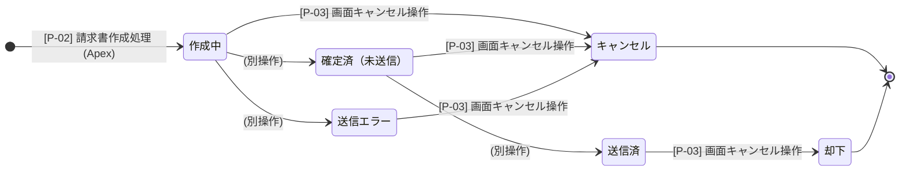

# 03｜状態遷移図

> [🔙 INDEX](./00_INDEX.md)

## 1. 状態遷移定義

- **対象オブジェクト**: 請求書情報 (`InvoiceHeader__c`)
- **対象ステータス項目**: 連携ステータス (`Status__c`)

> **備考**: 今回の「請求書作成フロー」では、新規作成時の「作成中」初期ステータス付与、および画面からのキャンセル操作をスコープとしています。後続のステータス遷移（送信、確定など）は全体像として記載しています。

---
