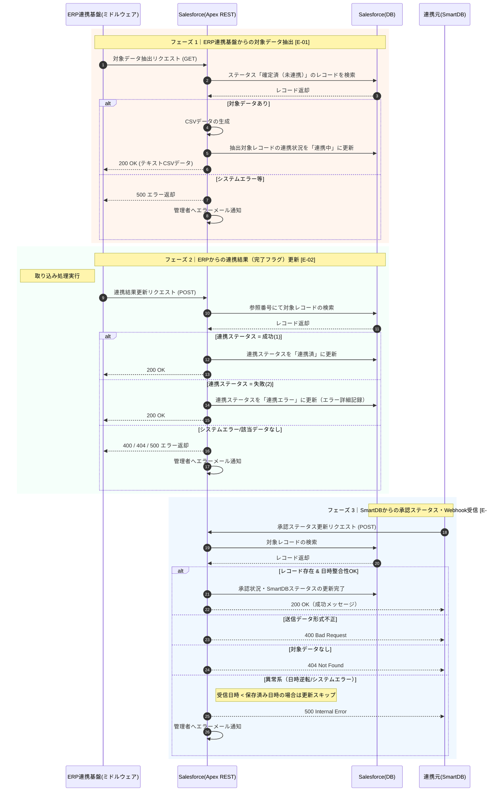

# 02｜システムシーケンス図

> [🔙 INDEX](./00_INDEX.md)

## 1. シーケンス定義

```mermaid
sequenceDiagram
    autonumber
    participant ERP as ERP連携基盤(ミドルウェア)
    participant SF_API as Salesforce(Apex REST)
    participant SF_DB as Salesforce(DB)
    participant SDB as 連携元(SmartDB)

    rect rgb(255, 245, 238)
    Note over ERP, SF_DB: フェーズ 1｜ERP連携基盤からの対象データ抽出 [E-01]
    ERP->>SF_API: 対象データ抽出リクエスト (GET)
    SF_API->>SF_DB: ステータス「確定済（未連携）」のレコードを検索
    SF_DB-->>SF_API: レコード返却
    
    alt 対象データあり
        SF_API->>SF_API: CSVデータの生成
        SF_API->>SF_DB: 抽出対象レコードの連携状況を「連携中」に更新
        SF_API-->>ERP: 200 OK (テキストCSVデータ)
    else システムエラー等
        SF_API-->>ERP: 500 エラー返却
        SF_API->>SF_API: 管理者へエラーメール通知
    end
    end

    rect rgb(245, 255, 250)
    Note over ERP, SF_DB: フェーズ 2｜ERPからの連携結果（完了フラグ）更新 [E-02]
    Note left of ERP: 取り込み処理実行
    ERP->>SF_API: 連携結果更新リクエスト (POST)
    SF_API->>SF_DB: 参照番号にて対象レコードの検索
    SF_DB-->>SF_API: レコード返却
    
    alt 連携ステータス = 成功(1)
        SF_API->>SF_DB: 連携ステータスを「連携済」に更新
        SF_API-->>ERP: 200 OK
    else 連携ステータス = 失敗(2)
        SF_API->>SF_DB: 連携ステータスを「連携エラー」に更新（エラー詳細記録）
        SF_API-->>ERP: 200 OK
    else システムエラー/該当データなし
        SF_API-->>ERP: 400 / 404 / 500 エラー返却
        SF_API->>SF_API: 管理者へエラーメール通知
    end
    end

    rect rgb(240, 248, 255)
    Note over SDB, SF_DB: フェーズ 3｜SmartDBからの承認ステータス・Webhook受信 [E-03]
    SDB->>SF_API: 承認ステータス更新リクエスト (POST)
    SF_API->>SF_DB: 対象レコードの検索
    SF_DB-->>SF_API: レコード返却
    
    alt レコード存在 & 日時整合性OK
        SF_API->>SF_DB: 承認状況・SmartDBステータスの更新完了
        SF_API-->>SDB: 200 OK（成功メッセージ）
    else 送信データ形式不正
        SF_API-->>SDB: 400 Bad Request
    else 対象データなし
        SF_API-->>SDB: 404 Not Found
    else 異常系（日時逆転/システムエラー）
        Note right of SF_API: 受信日時 < 保存済み日時の場合は更新スキップ
        SF_API-->>SDB: 500 Internal Error
        SF_API->>SF_API: 管理者へエラーメール通知
    end
    end
```

---
