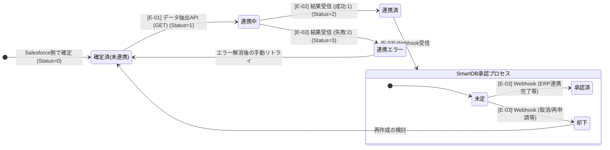

# 03｜状態遷移図

> [🔙 INDEX](./00_INDEX.md)

## 1. 状態遷移定義

- **対象オブジェクト**: 請求先（`BillingInformation__c`）および請求書情報（`InvoiceHeader__c`）
- **対象ステータス項目**: 連携ステータス（`SendStatus__c` / `Status__c`）

> **備考**: ERP連携処理に伴うステータスの変遷を定義します。対象データがSalesforce側の処理で「確定済（未連携）」となっている前提で記載しています。

---
