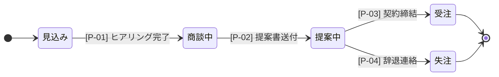
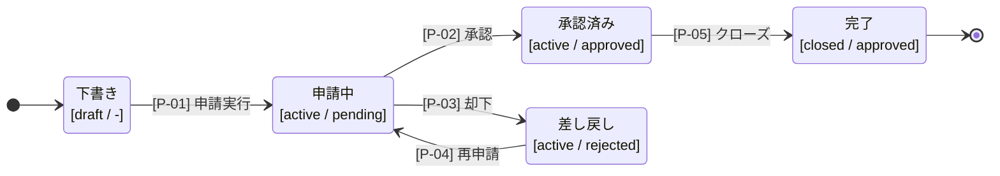
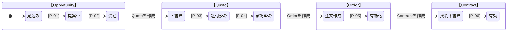
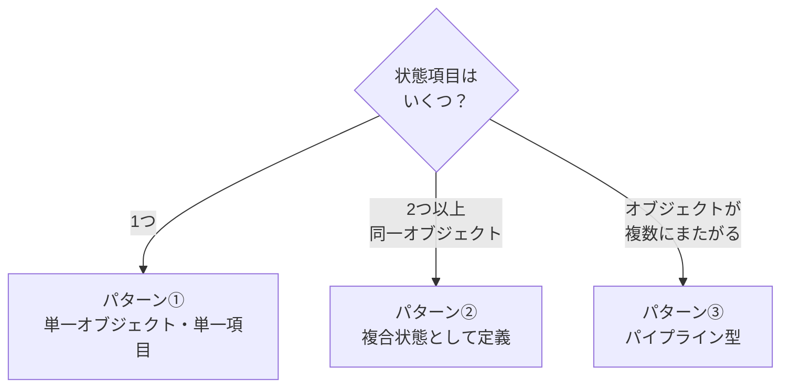

# Salesforce向け 状態遷移図 記述パターン集

> **前提**: Salesforceでは「状態」が複数のオブジェクト・複数の項目に分散するケースが多い。
> 本書では、その複雑性を整理するための記述パターンを3つ定義する。

---

## パターン① 単一オブジェクト・単一項目（基本形）

最もシンプルなケース。対象オブジェクトと項目を明記する。

### 対象
- オブジェクト：`Opportunity`
- 項目：`StageName`

---

## パターン② 単一オブジェクト・複数項目の組み合わせ

1つのオブジェクトに複数の状態項目が存在し、**組み合わせが業務上の意味を持つ**ケース。

### 対象
- オブジェクト：`案件__c`（カスタムオブジェクト）
- 項目①：`Status__c`（ステータス）
- 項目②：`Approval_Status__c`（承認状況）

### 記述方針
> 「複合状態」として `[ステータス / 承認状況]` の形式で表現する。

### 補足テーブル（複合状態の定義）

| 状態名 | Status__c | Approval_Status__c | 説明 |
|-------|-----------|-------------------|------|
| 下書き | `draft` | `—` | 作成中・未申請 |
| 申請中 | `active` | `pending` | 承認フロー実行中 |
| 承認済み | `active` | `approved` | 承認完了・業務継続中 |
| 差し戻し | `active` | `rejected` | 修正待ち |
| 完了 | `closed` | `approved` | 業務終結 |

---

## パターン③ 複数オブジェクトをまたぐ状態遷移（パイプライン型）

**Opportunity → Quote → Order → Contract** のように、業務の進行に伴いオブジェクトが変わるケース。

### 対象オブジェクト一覧

| オブジェクト | 状態項目 | 役割 |
|------------|--------|------|
| `Opportunity` | `StageName` | 商談ステージ |
| `Quote` | `Status` | 見積ステータス |
| `Order` | `Status` | 注文ステータス |
| `Contract` | `Status` | 契約ステータス |

### 記述方針
> オブジェクトを **レーン（subgraph）** で区切り、オブジェクト境界をまたぐ遷移を矢印で表現する。

### 処理インデックス（クロスオブジェクト版）

| 処理ID | 処理名 | オブジェクト | 状態遷移 (From → To) | 備考 |
|-------|-------|------------|---------------------|------|
| P-01 | 商談ステージ更新 | Opportunity | 見込み → 提案中 | — |
| P-02 | 受注確定 | Opportunity | 提案中 → 受注 | Quote.Statusが承認済みであること |
| P-03 | 見積送付 | Quote | 下書き → 送付済み | PDF添付必須 |
| P-04 | 見積承認 | Quote | 送付済み → 承認済み | 顧客署名確認 |
| P-05 | 注文有効化 | Order | 注文作成 → 有効化 | — |
| P-06 | 契約締結 | Contract | 契約下書き → 有効 | 法務確認済フラグ必須 |

---

## パターン選択ガイド

---

## ⚠️ Salesforce設計時の注意点

| 注意点 | 内容 |
|-------|------|
| **項目名は API参照名で記載** | 表示ラベルでなく `StageName`、`Status__c` 等を使うと実装との齟齬が防げる |
| **禁止遷移はValidation Ruleで保護** | 状態遷移図にない矢印（不正遷移）は、Validation Ruleで防止することを明記する |
| **自動処理の起動元を明記** | 状態変化がトリガーとなるFlowやApexは、シーケンス図と `[P-XX]` で紐付ける |
| **Picklist値との同期** | 状態遷移図の「状態名」はSalesforceのPicklist値と完全一致させること |

---

> 📝 作成日：2026-03-14
