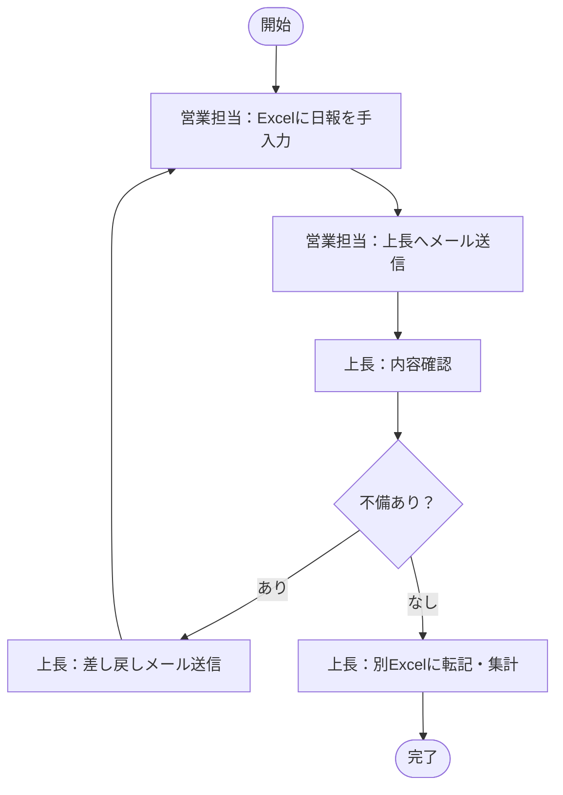
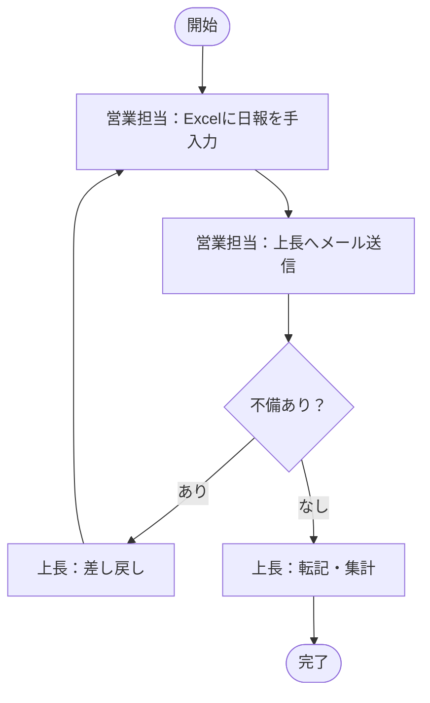

# 📊 業務ヒアリング勉強会｜スライド資料
## 〜ユーザーストーリーから「現場の業務」を読み解き、PBIを爆速で作成する〜

> **所要時間**: 約60〜90分 ／ **対象**: 開発チームメンバー全員

---

## 📋 目次

| スライド | タイトル | 時間 |
|---------|---------|------|
| [S1](#s1-オープニング) | オープニング | 5分 |
| [S2](#s2-業務ヒアリングとは) | 業務ヒアリングとは？ | 10分 |
| [S3](#s3-業務フロー図の見方書き方) | 業務フロー図の見方・書き方 | 15分 |
| [S3-B](#s3-b-ai--mermaid-で業務フローを管理する) | AI + Mermaid でBacklogに業務フローを直接記載する | 参考 |
| [S4](#s4-ユーザーストーリーマップの活用) | ユーザーストーリーマップの活用 | 10分 |
| [S5](#s5-pbiテンプレートの使い方デモ) | PBIテンプレートの使い方（デモ） | 10分 |
| [S6](#s6-ハンズオン実践️-20分) | ハンズオン（実践） | 20分 |
| [S7](#s7-まとめ) | まとめ・Q&A | 10分 |

> **合計**: 約80分（S3-Bは時間に応じて省略可）

---

---

# 【S1】オープニング

## なぜ、この勉強会をやるのか？

### 🔍 今の課題

```
ヒアリングは PLだけがやるもの   ← この認識が、ボトルネックを生んでいる
```

- PL だけが業務知識を吸収 → 属人化・引き継ぎリスク・設計ミス
- メンバーは「言われた通り作る」→ ユーザーに寄り添えない

### 🎯 今日のゴール

> **チーム全員が「自分もヒアリングできる」と思える状態になること**

### 📋 今日話すこと・話さないこと

| 話すこと ✅ | 話さないこと ❌ |
|-----------|--------------|
| ヒアリングの「設計」の仕方 | Salesforce の実装詳細 |
| 業務フロー図の読み書き | 要件定義書の作り方（フルバージョン） |
| PBIテンプレートの使い方 | 承認フローのルール |

---

---

# 【S2】業務ヒアリングとは？

## ヒアリングの本質

> **「要求（ユーザーの声）」を「要件（システムで実現すること）」に変換する作業**

```
ユーザー
  │
  ├─ 言えること：「今の不満」「改善したい気持ち」
  └─ 言えないこと：「解決策」「本当の業務フロー」「例外ケース」

                  ↑ ここを引き出すのがヒアリング
```

---

## ❌ よくある失敗パターン

| パターン | 症状 | 対策 |
|---------|------|------|
| **手段と目的の混同** | 「Excelを作ってほしい」→ Excelを作る | 「なぜExcelが必要か？」を聞く |
| **沈黙が怖くて次に進む** | 確認が不十分なまま設計 | 沈黙は「考えている」サイン。待つ |
| **聞いたことをそのまま要件にする** | 仕様変更が多発 | 「つまり〇〇ということですか？」と言い換えて確認する |

---

## 💡 ヒアリングで引き出すべき3層構造

```
┌─────────────────────────────────────────┐
│  ③ To-Be（理想状態）                     │
│    「どうなれば一番助かるか？」            │
├─────────────────────────────────────────┤
│  ② Pain（痛み・不満）                    │
│    「何が一番面倒・手間か？」              │
├─────────────────────────────────────────┤
│  ① As-Is（現状の業務フロー）              │
│    「今、実際にどうやっているか？」         │
└─────────────────────────────────────────┘
```

---

---

# 【S3】業務フロー図の見方・書き方

## 業務フロー図で明らかにすること

**「誰が・何を・どの順番でやっているか（手順と責任の分担）」**

---

## 🔤 テキストベースでの書き方（PBIテンプレート形式）

### ルール3つだけ

```
[担当者]  → 誰がやるかを主語にする（必ず書く）
[システム] → 自動処理はシステム主語で書く
[分岐]    → 条件によって処理が変わる場所を明示する
```

---

## ✍️ 記述例：日報提出フロー

### ❌ As-Is（現状）

```
1. [営業担当] Excelに日報を手入力する
2. [営業担当] 上長のメールアドレスに添付送信する
3. [上長] メールを受信し、内容を確認する
   └─ [分岐] 不備がある場合：[上長] 差し戻しメールを返信する → 1. に戻る
4. [上長] 別のExcelにデータを転記・集計する
```

### ✅ To-Be（改善後）

```
1. [営業担当] Salesforce の日報画面から入力・保存する
2. [システム] 保存と同時に上長に承認依頼通知を送る
3. [上長] 通知をクリックし、承認ボタンを押す
   └─ [分岐] 不備がある場合：[上長] 差し戻しボタンをクリック → 担当者に再提出通知
4. [システム] 承認完了後、自動集計レポートに反映する
```

**▶️ ポイント：手入力・メール・転記 → すべて「システム」に置き換えると To-Be になりやすい**

---

# 【S3-B】AI + Mermaid で業務フローを管理する

> **図解ツールを開かなくても、ヒアリングのメモから数秒でフロー図を生成し、PBIに直接埋め込む手法**

## 🛠️ ツール連携の全体像（3ステップ）

```
STEP 1：ヒアリングで取ったメモ（箇条書きでOK）をAIに投げる

STEP 2：AIがMermaid記法のフロー図コードを生成する

STEP 3：Backlog PBIテンプレートの「2-B. 業務フロー図（Mermaid）」欄に
         コードブロックとして貼り付ける
         → Backlogが自動でフロー図として表示！
```

---

## 💬 STEP 1：AIへのプロンプト例

```
以下の業務フローメモを、Mermaidのflowchart記法に変換してください。
担当者は「営業担当」「上長」「システム」の3種類です。

【メモ】
・営業担当がExcelに日報を書く
・メールで上長に送る
・上長が確認して、不備があれば差し戻す
・問題なければ上長が別Excelに転記する
```

---

## ⚙️ STEP 2：AIが生成するMermaid出力イメージ



---

## 📋 STEP 3：Backlog PBIへの貼り付け形式

**PBIテンプレートの所定欄にそのまま貼るだけでフロー図が完成する：**

~~~markdown
## 2-B. 業務フロー図（Mermaid記法）

### As-Is（現状）


~~~

> **✅ PBIを開けば、テキストと図が常に一体化して見れる**

---

---

# 【S4】ユーザーストーリーマップの活用

## フロー図 vs ユーザーストーリーマップ

| | 業務フロー図 | ユーザーストーリーマップ |
|---|------------|-------------------|
| **焦点** | 手順・処理の順番 | 感情・体験・痛み |
| **問い** | 誰が・何をするか | どこで辛いか・何を望むか |
| **使いどころ** | 設計の根拠にする | ペインポイントを発見する |

> **セットで使うことで「何を作るか（フロー）」と「なぜ作るか（ストーリー）」が揃う**

---

## 🎙️ ストーリーを引き出す質問セット

```
① 現状把握
  「今はどのような手順でやっていますか？」

② ペイン発見
  「その中で一番手間がかかる・面倒なのはどこですか？」
  「その作業、正直どう感じていますか？」

③ 例外確認
  「うまくいかないときはどう対処しますか？」

④ To-Be 確認
  「理想的には、どういう状態になれば一番助かりますか？」
```

---

## ✍️ 記述例：ユーザーストーリーマップ

```markdown
🚨 現状のペイン
・Excelファイルを毎日手作業で更新するのが手間
・集計ミスが月2〜3回発生し、修正に30分かかる

ユーザーの生の声（Voice of User）
・「このExcel作業、毎日やる意味があるの？って思う」
・「自動化されたら、提案活動にもっと時間を使える」

💡 期待する状態
・保存ボタンひとつで報告が完結する状態
```

> **💡 コツ：「生の声」はそのまま書く。加工するとニュアンスが変わり、後で仕様にズレが生じる**

---

---

# 【S5】PBIテンプレートの使い方（デモ）

## テンプレートの全体構成

```
PBI向け 業務フロー・ストーリー記録テンプレート
│
├─ 0. ヒアリング準備・情報
│    └─ ターゲットPBI / ヒアリング設計 / 質問リスト
│
├─ 1. ユーザーストーリーマップ
│    └─ 現状のペイン / ユーザーの声 / 期待する状態
│
├─ 2. 業務フロー（テキストベース）
│    └─ As-Is / To-Be
│
├─ 2-B. 業務フロー図（Mermaid記法）  ← ☆ NEW
│    ├─ As-Is図（コードブロック）
│    └─ To-Be図（コードブロック）
│
└─ 3. PBI要件
     └─ 受入条件（AC） / 必要な設定・開発要素
```

---

## 🖥️ デモ：商談クローズ時の自動通知（実例）

**PBIのユーザーストーリー**

```
As a：営業マネージャー
I want to：商談が「成立」になった際、関係者にSlack通知し、
          未完了タスクを自動クローズしてほしい
So that：チームで即時に共有しつつ、手動作業の手間を省きたい
```

**ヒアリング前の仮説**：
- 現状は手動Slack投稿 → 連絡漏れが発生している
- 古いタスクが残り、ダッシュボードが汚染されている

**▶️ この仮説を持ってヒアリングに臨む = 質問の精度が上がる**

---

---

# 【S6】ハンズオン（実践）⏱️ 20分

## 📝 お題

> **「営業担当者が日報を毎日Excelに手入力してメールで上長に送っている。これを改善したい。」**

---

## 🔧 作業内容（10〜15分）

**グループ（2〜3人）で以下を埋めてください：**

### ① ヒアリング設計（「施策1」のシートを使用）

```markdown
ヒアリング対象者：
ヒアリングゴール：
事前仮説（As-Is）：
質問リスト：
  1. 
  2. 
  3. 
```

### ② ユーザーストーリーマップ

```markdown
🚨 現状のペイン：

ユーザーの生の声：
・「                         」

💡 期待する状態：
```

### ③ As-Is フロー（テキストベース）

```markdown
1. [　　] 
2. [　　] 
3. [　　] 
```

---

## 💬 発表・ディスカッション（5〜10分）

- 各グループが記入内容を発表
- **「どんな質問をすれば引き出せるか？」** をチームで議論

---

---

# 【S7】まとめ

## 📌 今日のポイント3選

### 1️⃣ ヒアリングは「設計」してから臨む

> ユーザーストーリーを読んで「誰に・何を聞くか」を決めてからヒアリングする

### 2️⃣ フロー図とユーザーストーリーマップはセットで使う

> 「手順（フロー）」と「体験・感情（ストーリー）」を両方残すことで設計の根拠が生まれる

### 3️⃣ PBIテンプレートで「記録ゼロ」をなくす

> 完璧でなくていい。途中でもいいので記録を残すことが大事

### 4️⃣ AI + Mermaid でPBI内にフロー図を直接描画する

> ヒアリングメモをAIでMermaid化し、Backlog PBI内に直接埋め込んで一元管理する

---

## 🚀 明日からやってほしいこと

> **次のスプリントで、担当PBIを1件選んでPBIテンプレートを使ったヒアリングにトライする**

```
STEP 1：担当PBIのユーザーストーリーを読む
STEP 2：「施策1」のヒアリング設計シートで事前準備
STEP 3：ヒアリングを実施（30〜60分）
STEP 4：ヒアリングメモをAIに投げてMermaidのフロー図コードを生成
STEP 5：Backlog PBIテンプレートのフロー図セクションにコードを貼り付け
STEP 6：テキストのヒアリング録とあわせてPBIを保存
STEP 7：チームに共有してフィードバックをもらう
```

---

## 明日から使える「3つの質問」

| タイミング | 質問 |
|-----------|------|
| 業務の現状を把握したい | 「今はどのような手順でやっていますか？」 |
| 課題を引き出したい | 「その中で一番手間がかかるのはどこですか？」 |
| To-Be をすり合わせたい | 「理想的には、どういう状態になれば助かりますか？」 |

---

## Q & A

---

---

# 📎 参考資料

- [施策1：ユーザーストーリーからヒアリング設計](../🏫%20Enablement/施策1_ユーザーストーリーからヒアリング設計.md)
- [施策3：PBIテンプレートの実践運用](../🏫%20Enablement/施策3_PBIテンプレートの実践運用.md)
- [PBI記入例：商談クローズ時の自動通知](./PBI試作_01.md)

---

> 📝 資料バージョン：v1.0 ／ 作成日：2026-03-14
