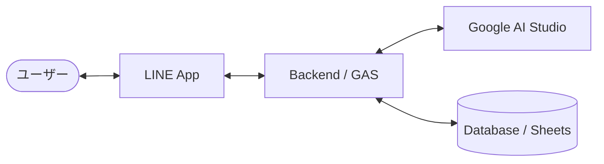

# 02｜技術スタック・構成案

## 1. 採用技術
- **AI Engine**: Google AI Studio (Gemini API)
- **Interface**: LINE Messaging API
- **Backend (選択中)**: 
  - 第一候補: Google Apps Script (GAS) ※手軽さと実行環境の容易さ
  - 第二候補: Node.js (Vercel/Cloudflare Workers)
- **Database**: 
  - GASの場合: Google Sheets または PropertiesService
  - Node.jsの場合: Cloudflare D1 / Supabase

## 2. システム構成案

## 3. 検討事項
- 音声ファイルの文字起こし（Whisper vs Gemini 1.5のネイティブマルチモーダル活用）
- プロンプトのテンプレート化と調整
