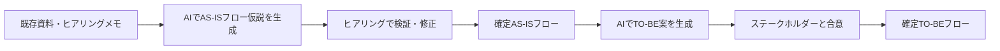
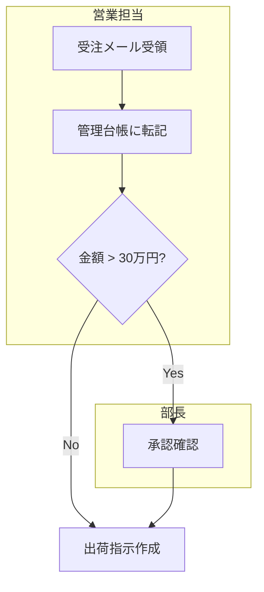

# 業務フロー図：AI活用方法

業務フロー図の作成・検証・更新においてAIを「高速アシスタント」として活用することで、現状把握の精度向上と作業時間の大幅な短縮が可能です。

---

## 1. プロセスの全体像



---

## 2. 実践プロンプト集

### A. AS-ISフロー仮説の生成
<details>
<summary>プロンプトと成果物イメージを表示</summary>

```text
あなたはシステム開発の要件定義専門家です。
以下の資料をもとに、現行（AS-IS）の業務フロー仮説をMermaid記法のフローチャートと
ステップテーブルの両方で作成してください。

【資料】
{マニュアル・設計書・ヒアリングメモを貼り付け}

【出力形式】
1. Mermaid記法のスイムレーン図（担当者をレーンで分割）
2. テーブル形式の補足（担当者 / 作業内容 / 使用ツール）
3. ヒアリングで確認すべき不明点リスト
```

#### 成果物イメージ（Mermaid出力例）

</details>

### B. TO-BEフロー（将来業務フロー）の生成
<details>
<summary>プロンプトと成果物イメージを表示</summary>

```text
以下の「確定AS-ISフロー」と「収集した改善要求」をもとに、
新システム導入後の将来業務フロー（TO-BE）を作成してください。

【AS-ISフロー】
{確定したAS-ISフローを貼り付け}

【改善要求】
{問題点・改善要求リストを貼り付け}

【出力形式】
1. TO-BEフロー（Mermaid + テーブル形式）
2. AS-ISとTO-BEの変更点サマリー（削除された作業 / 新規追加の作業 / 自動化された作業）
3. TO-BE実現のために必要なシステム機能（要件候補）
```
</details>

### C. 複数フローの統合・整合チェック
<details>
<summary>プロンプトを表示</summary>

```text
以下の複数の業務フロー図を読み込み、
部門間の引き継ぎポイントに矛盾や漏れがないかをチェックしてください。

【フロー一覧】
{複数のフローを貼り付け}

出力：
1. 引き継ぎポイント一覧（From部門 / To部門 / トリガー / 引き渡しデータ）
2. 矛盾・不整合の疑念箇所リスト
3. 追加確認が必要な接続点
```
</details>

---

## 3. AI活用のコツ

- **Mermaid記法で出力させる**: PlantUML/Mermaidでそのまま図を生成できる形式を指定すると、後工程での編集コストが下がります。
- **汚いメモでも投入可能**: ヒアリング中の走り書きメモをそのままプロンプトに貼っても、AIが整理してフローに落とし込みます。
- **レビューをAIに依頼**: 作成後に「このフローに抜け漏れや矛盾はないか」とAIにチェックさせることで品質を担保します。

## 4. リファレンス
- 🔗 [手法詳細](./手法詳細.md)
