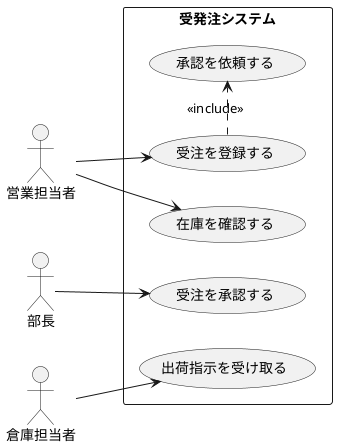

# ユースケース図：AI活用方法

ユースケース図の作成においてAIを活用することで、業務ヒアリングの結果を迅速にUMLへ変換し、網羅性の確認と記述の品質向上を同時に実現できます。

---

## 1. 実践プロンプト集

### A. ユースケースの洗い出しと図の生成
<details>
<summary>プロンプトと成果物イメージを表示</summary>

```text
あなたはUML設計の専門家です。
以下の業務フロー・ヒアリング情報をもとに、ユースケース図をPlantUML形式で作成してください。

【情報】
{業務フロー・ヒアリングメモを貼り付け}

【出力形式】
1. PlantUML形式のユースケース図コード
2. アクター一覧（役割と主な責務）
3. ユースケース一覧（カテゴリ付き）
4. 抜け漏れが疑われるユースケースの指摘
```

#### 成果物イメージ（PlantUML出力例）

</details>

### B. ユースケース記述書の自動生成
<details>
<summary>プロンプトと成果物イメージを表示</summary>

```text
以下のユースケース「{ユースケース名}」について、ユースケース記述書を作成してください。

出力形式：
| 項目 | 内容 |
- ユースケース名
- アクター（主・副）
- 事前条件
- 基本フロー（1. 2. 3. ステップ形式）
- 代替フロー（例外ケース）
- 事後条件（成功時 / 失敗時）
```

#### 成果物イメージ
| 項目 | 内容 |
| :--- | :--- |
| **ユースケース名** | 受注を登録する |
| **アクター（主）** | 営業担当者 |
| **事前条件** | ログイン済みであること / 顧客マスタに対象顧客が存在すること |
| **基本フロー** | 1. 担当者が受注入力画面を開く 2. 顧客コードを入力する 3. 商品・数量・納期を入力する 4. 登録ボタンを押す 5. 承認依頼メールが上長に自動送信される |
| **代替フロー** | 在庫不足の場合 → 警告メッセージを表示し、入力を継続可（在庫確保は別途調整） |
| **事後条件（成功）** | 受注が「受付中」ステータスで登録される |
</details>

### C. 権限マトリックスの生成
<details>
<summary>プロンプトを表示</summary>

```text
以下のアクターとユースケース一覧をもとに、「誰がどのユースケースを実行できるか」を示す
権限マトリックス（テーブル形式）を作成してください。
アクター：{列挙}
ユースケース：{列挙}
```
</details>

---

## 2. AI活用のコツ
- **PlantUMLで出力させる**: テキストベースの記法なので、バージョン管理やドキュメントへの埋め込みが容易です。
- **ユースケース記述書を一括生成**: 全ユースケースのリストをAIに渡し、記述書のテンプレートを一括生成させると時間短縮になります。

## 3. リファレンス
- 🔗 [手法詳細](./手法詳細.md)
