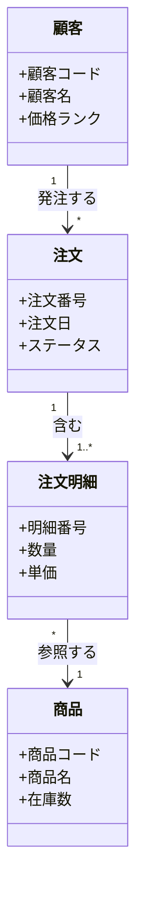

# DMM（ドメインモデル図）：AI活用方法

業務領域の概念を整理するDMMにAIを活用することで、ヒアリング情報から迅速に概念モデルの初期版を作成し、関係者との合意形成をスムーズに進めることができます。

---

## 1. 実践プロンプト集

### A. エンティティの抽出とDMMの生成
<details>
<summary>プロンプトと成果物イメージを表示</summary>

```text
あなたは業務分析の専門家です。
以下の情報から、この業務に登場する主要な概念（エンティティ）とその関係を整理し、
ドメインモデル図をMermaid記法（classDiagram）で作成してください。

【情報】
{業務フロー・ヒアリングメモ・既存資料を貼り付け}

【ルール】
- 技術的な実装ではなく、業務担当者が使う言葉（業務用語）でエンティティを命名すること
- 各エンティティに代表的な属性を2〜3件付与すること
- 関連には動詞ラベルを付けること（例：「顧客 --> 注文 : 発注する」）
- 設計上不自然な多対多があれば中間エンティティを提案すること
```

#### 成果物イメージ（Mermaid出力例）

</details>

### B. ER図へのインプット精査
<details>
<summary>プロンプトを表示</summary>

```text
以下のドメインモデル図をER図（論理データモデル）設計にインプットするため、
各エンティティの属性を追記し、PKの候補を提案してください。
また、多対多の関係があれば中間テーブルを提案してください。

【ドメインモデル】
{Mermaidのコードを貼り付け}
```
</details>

---

## 2. AI活用のコツ
- **業務用語でエンティティを命名させる**: プロンプトで「業務担当者が使う言葉で」と明示することで、技術的な命名（UserTable等）を防げます。
- **既存ER図からのリバース**: 既存のER図やDB定義書を投入し「ビジネス目線のDMMを逆生成してください」と指示すると、ドキュメントがない場合の出発点にできます。

## 3. リファレンス
- 🔗 [手法詳細](./手法詳細.md)
