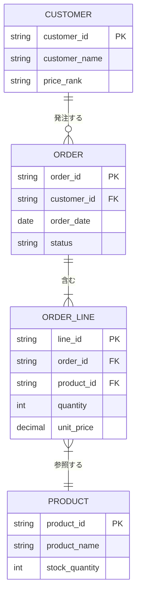

# ER図（論理データモデル）：AI活用方法

ER図の設計においてAIを活用することで、DMMや既存資料から論理データモデルの初期版を迅速に生成し、正規化の漏れや設計上の問題を早期に発見できます。

---

## 1. 実践プロンプト集

### A. DMMを元にしたER図の生成
<details>
<summary>プロンプトと成果物イメージを表示</summary>

```text
あなたはデータベース設計の専門家です。
以下のドメインモデル図（DMM）をもとに、論理ER図をMermaid記法（erDiagram）で作成してください。

【DMм（ドメインモデル）】
{DMMのMermaidコードまたはエンティティ一覧を貼り付け}

【ルール】
- 全エンティティに主キー（PK）を定義する
- 多対多の関係は中間テーブルで解消する
- 外部キー（FK）を明記する
- 主要な属性を各エンティティに付与する（データ型は任意でよい）
```

#### 成果物イメージ（Mermaid出力例）

</details>

### B. 既存DDLからのER図リバース生成
<details>
<summary>プロンプトを表示</summary>

```text
以下のDDL（CREATE TABLE文）を分析し、テーブル間の関係をMermaid erDiagram形式で表現してください。
外部キー制約が明示されていない場合は、カラム名から関連を推測し「推測」と注釈を付けてください。

【DDL】
{CREATE TABLE文を貼り付け}
```
</details>

### C. 正規化チェック
<details>
<summary>プロンプトを表示</summary>

```text
以下のテーブル定義が第3正規形（3NF）を満たしているか確認し、
問題がある場合は修正案を提示してください。

【テーブル定義】
{テーブル名・属性一覧を貼り付け}

出力：
1. 各正規形への適合状況（1NF / 2NF / 3NF）
2. 違反している箇所とその理由
3. 修正案（テーブル分割案）
```
</details>

---

## 2. AI活用のコツ
- **Mermaid erDiagram形式で出力させる**: Obsidianのプレビューでそのまま図として確認でき、Git管理も容易です。
- **DDLを逆変換**: 既存DBのDDLを投入してER図を自動生成させると、設計書がない現行システムの把握に役立ちます。

## 3. リファレンス
- 🔗 [手法詳細](./手法詳細.md)
