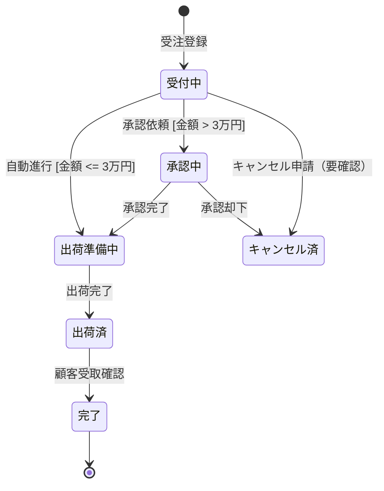

# 状態遷移図：AI活用方法

状態遷移図の設計においてAIを活用することで、業務ルールや業務フローから状態と遷移を網羅的に抽出し、設計上の抜け漏れや矛盾を早期に発見できます。

---

## 1. 実践プロンプト集

### A. 状態遷移図の生成
<details>
<summary>プロンプトと成果物イメージを表示</summary>

```text
あなたはシステム設計の専門家です。
以下の情報を元に、{エンティティ名}の状態遷移図をMermaid記法（stateDiagram-v2）で作成してください。

【情報】
{業務フロー・ヒアリングメモ・業務ルールを貼り付け}

【ルール】
- 初期状態と終了状態を明確に定義すること
- 各遷移にトリガー（イベント）を付記すること
- 条件が必要な遷移にはガード条件 [条件] を明記すること
- ヒアリング情報だけでは判断できない遷移には「（要確認）」と注記すること
```

#### 成果物イメージ（Mermaid出力例）

</details>

### B. 状態遷移表の生成
<details>
<summary>プロンプトと成果物イメージを表示</summary>

```text
以下の状態遷移図をもとに、状態遷移表（テーブル形式）を作成してください。
また、「この状態でこの操作は許可されているか」を示す操作可否マトリックスも作成してください。

【状態遷移図】
{Mermaidコードを貼り付け}
```

#### 成果物イメージ（状態遷移表）
| 現在の状態 | イベント | ガード条件 | 遷移先の状態 |
| :--- | :--- | :--- | :--- |
| 受付中 | 承認依頼 | 金額 > 3万円 | 承認中 |
| 受付中 | 自動進行 | 金額 ≤ 3万円 | 出荷準備中 |
| 承認中 | 承認完了 | なし | 出荷準備中 |
| 承認中 | 承認却下 | なし | キャンセル済 |
</details>

### C. デッドロックと抜け漏れのチェック
<details>
<summary>プロンプトを表示</summary>

```text
以下の状態遷移図を分析し、設計上の問題を指摘してください。

【状態遷移図】
{Mermaidコードを貼り付け}

チェック観点：
1. 遷移先がなく行き詰まる状態（デッドロック状態）の有無
2. 到達不可能な状態の有無
3. 終了状態がない（永遠にループする）パスの有無
4. ガード条件の網羅性（Yesのパスだけあり、Noのパスがない分岐等）
5. 業務上ありえる例外遷移（キャンセル・差し戻し等）の抜け漏れ
```
</details>

---

## 2. AI活用のコツ
- **Mermaid stateDiagram-v2で出力させる**: Obsidianでのプレビューで視覚的に確認でき、Git管理も容易です。
- **チェックをAIに依頼**: 作成後に「この状態遷移図に設計上の問題はないか」とAIにチェックさせることで、デッドロックや分岐の抜け漏れを発見できます。
- **ユースケースと対応させる**: 各遷移は「誰が（アクター）」「何の操作で（ユースケース）」引き起こされるかを対応させると、ユースケース図との整合性が保ちやすくなります。

## 3. リファレンス
- 🔗 [手法詳細](./手法詳細.md)
