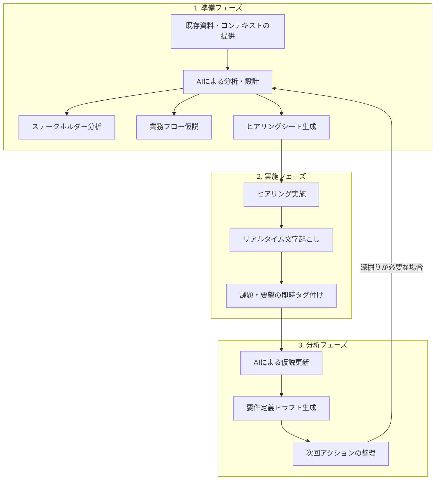

# ヒアリング / インタビュー：AI活用方法

システム開発プロジェクトの要求定義において、AIを「伴走者」として活用し、ヒアリングの準備・実施・分析を体系的に効率化・高度化する方法をまとめます。

---

## 1. ヒアリングAI活用プロセスの全体像

AIを活用することで、従来の「行き当たりばったりのヒアリング」から、**「仮説検証型のスマートなヒアリング」**へと転換します。



---

## 2. 準備フェーズ：AI活用の設計とインプット

ヒアリングの質は、AIに与える「インプット資料」とそれに基づく「事前成果物」で決まります。

### 2-1. 必要となるインプット資料
AIに以下の情報を読み込ませることで、精度の高い成果物が得られます。
- **既存ドキュメント**: 業務マニュアル、規程、手順書、現行システムの仕様書。
- **組織情報**: 組織図、対象者の役職・役割。
- **プロジェクト背景**: 刷新の目的、解決したい上位レベルの課題。

### 2-2. AIによる3つの事前成果物

| 成果物 | AIの役割 | 成果物イメージ |
| :--- | :--- | :--- |
| **① ステークホルダー分析表** | 立場から関心事や懸念事項を推論。 | [イメージを見る](#成果物イメージステークホルダー分析) |
| **② 業務フロー仮説 (AS-IS)** | 資料から業務ステップと不明点を抽出。 | [イメージを見る](#成果物イメージ業務フロー仮説) |
| **③ AIヒアリングシート** | 構造化された質問リストを生成。 | [イメージを見る](#成果物イメージ質問票) |

---

## 3. 実践プロンプト集 & 成果物イメージ

### A. ステークホルダー分析
<details>
<summary>プロンプトと成果物イメージを表示</summary>

#### プロンプト
```text
以下のステークホルダー情報をもとに、各人物に対して
「関心事の仮説」「主な懸念事項」「ヒアリングで聞くべきトピック」を整理してください。

プロジェクト概要: [入力]
ステークホルダー:
- 氏名/役職: [山田部長 / 営業本部長]
  - プロジェクトへの関与: スポンサー
- 氏名/役職: [田中さん / 営業チームリーダー]
  - プロジェクトへの関与: キーユーザー
```

<a id="成果物イメージステークホルダー分析"></a>
#### 成果物イメージ
| ステークホルダー | 関心事の仮説 | 主な懸念事項 | ヒアリングのトピック |
| :--- | :--- | :--- | :--- |
| 山田部長 | 投資対効果、業績向上 | コスト超過、遅延 | KPI定義、成功基準、予算 |
| 田中さん | 業務効率、使い勝手 | 操作変更の不安、手間 | 現状不満、必須機能、要望 |
</details>

### B. 業務フロー仮説の生成
<details>
<summary>プロンプトと成果物イメージを表示</summary>

#### プロンプト
```text
あなたはシステム開発の要件定義専門家です。
以下の資料をもとに、現行業務フローの仮説を作成してください。

【資料】
{マニュアル・業務規程・組織図・現行システムの画面説明などを貼り付け}

【出力形式】
1. 業務フロー仮説（テーブル形式）
   - 「担当者」「作業内容」「使用ツール/システム」を列に含む表で作成してください。
   - 判断分岐がある箇所は作業内容の中で条件を明記してください。

2. 登場人物・部門リスト
   - この業務に関わる役職・部門の一覧

3. ヒアリングで確認すべき不明点リスト
   （資料だけでは分からなかった点、例外的なケース、イレギュラー対応など）
```

<a id="成果物イメージ業務フロー仮説"></a>
#### 成果物イメージ
> **1. 業務フロー仮説**
> | 担当者 | 作業内容 | 使用ツール/システム |
> | :--- | :--- | :--- |
> | 営業担当 | 注文メールを受領し、管理台帳へ転記 | Outlook, Excel管理台帳 |
> | 営業担当 | [判断] 通常注文の場合はSTEP3へ、特急注文の場合は部長へ承認依頼 | Outlook |
> | 営業部長 | 特急注文の内容を確認し、承認/否認を返信 | 社内承認システム |
>
> **2. 登場人物リスト**
> - 営業担当, 営業部長, 経理担当
>
> **3. ヒアリングでの確認ポイント**
> - 特急注文と判断される具体的な金額閾値や条件
> - 部長が社外にいる場合の代理承認ルートの有無
</details>

### C. ヒアリング質問票の自動生成
<details>
<summary>プロンプトと成果物イメージを表示</summary>

#### プロンプト
```text
あなたは経験豊富なビジネスアナリストです。
別添の「ヒアリングシート_フォーマット仕様書」の構成に従い、以下の情報を元に[対象業務]の担当者向け質問票を生成してください。

【情報】
- プロジェクト概要: [入力]
- 対象者の役割: [入力]
- 事前に把握している課題・仮説: [入力]

【出力のルール】
以下の5つのカテゴリに分類して質問を作成してください。
1. 現状業務の流れ（AS-IS）: ステップごとの実態把握
2. 課題・ペインポイント: 困りごと、非効率な作業、ミス発生箇所
3. 例外処理・特殊ケース: 特急対応、イレギュラー、繁忙期の変化
4. システム化への期待・要望: Must/Want要件、理想の状態
5. 制約・前提条件: 法規制、社内ルール、既存システム連携

【出力形式】
テーブル形式で以下の5列を出力してください。
- No. / カテゴリ / 質問内容 / 確認の目的 / 要確認（確信度）

※「要確認（確信度）」は以下の基準で判定してください。
- 高（🔴）：資料に記載がない、または推測であり必ず確認が必要
- 中（🟡）：資料から推測できるが、詳細や条件の確認が必要
- 低（🟢）：資料に明記されており、認識合わせのみでよい
```

<a id="成果物イメージ質問票"></a>
#### 成果物イメージ
| No. | カテゴリ | 質問内容 | 確認の目的 | 要確認 |
| :--- | :--- | :--- | :--- | :--- |
| 1 | 現状業務 | 受注チャネル（電話・FAX等）の比率を教えてください。 | 開発スコープ（EDI連携要否等）の判断 | 🔴 高 |
| 2 | 課題 | 二重入力が発生している箇所は具体的にどこですか？ | 自動化による改善インパクトの算出 | 🔴 高 |
| 3 | 例外 | 月末の繁忙期にのみ発生する特殊な承認フローはありますか？ | 例外処理設計への反映 | 🟡 中 |
| 4 | 要望 | 現場で「これだけは変えたくない」という操作はありますか？ | ユーザーの心理的抵抗・移行リスクの把握 | 🔴 高 |
| 5 | 制約 | 関連する業界特有の法規制や保存義務はありますか？ | 非機能要件（セキュリティ・監査）の定義 | 🟢 低 |

> 🔗 **ヒント**: 生成されたデータを [ヒアリングシート_テンプレート](./ヒアリングシート_テンプレート.md) に転記して使用してください。
</details>

### D. ヒアリング後の仮説更新（状況別プロンプト集）
ヒアリング後の「メモ整理 → AI投入 → 成果物確認」という実務プロセスに特化したプロンプトのバリエーションです。

<details>
<summary>プロンプト例 A：基本版（当初の仮説とメモを照合）</summary>

```text
あなたはシステム開発の要件定義専門家です。
以下の「当初の業務フロー仮説」と「ヒアリングメモ」をもとに、仮説を更新してください。

━━━━━━━━━━━━━━━━━━━━━━━━━━━━
【当初の業務フロー仮説】
{ヒアリング前に生成したフローを貼る}
━━━━━━━━━━━━━━━━━━━━━━━━━━━━
【ヒアリングメモ】
{ヒアリング中に取ったメモ（汚くてよい）を貼る}
━━━━━━━━━━━━━━━━━━━━━━━━━━━━

以下の形式で出力してください。
1. 更新済み業務フロー（★で変更明示、担当/内容/ツール/確信度を記載）
2. 変更点サマリー（追加/修正/削除/確信度アップ）
3. 次回ヒアリングで確認すべき残課題（優先度別）
4. 要件定義への反映候補（機能/非機能/データ）
```
</details>

<details>
<summary>プロンプト例 B：キーワードしかない走り書きメモから更新</summary>

```text
メモが断片的ですが、情報を読み取って仮説を更新してください。
不明な箇所は「（要確認）」と明記し、推測箇所を提示してください。
```
</details>

<details>
<summary>プロンプト例 C：仮説更新 ＋ 担当者への確認メール生成</summary>

```text
仮説の更新（★差分明示）に加え、担当者への「認識相違確認用メール（丁寧・簡潔・300字以内）」をあわせて生成してください。
```
</details>

<details>
<summary>プロンプト例 D：複数回のヒアリング結果を統合</summary>

```text
これまでの2回のヒアリングメモを統合してください。
1. 統合済み最新フロー（前回差分：★、今回差分：★★） 2. 部門間の認識相違/矛盾点 3. 次回ヒアリングの最重要事項
```
</details>

---

## 4. 詳細手順（Deep Dive）：ヒアリング後の仮説更新 実践ガイド
> **人間のメモ → AIプロンプト → 成果物** への完全手順書。

### Step 1. メモを整理する（5〜10分）
ヒアリング中は「3つの記号」だけ意識してメモします。
- `✓`：仮説が合っていた / `✗`：仮説が間違っていた / `?`：新情報・不明点
- **コツ**: ヒアリング直後に記号の漏れを補い、重要発言には `★` を付けます。

### Step 2. AIにプロンプトを投げる（2〜3分）
前述の「プロンプト例 A〜D」から状況に合うものを選択し、セパレータ（━━━━）を使って「仮説」と「メモ」をそのまま貼り付けます。

### Step 3. 成果物を確認・修正する（10〜15分）
プロンプトA（基本版）を使用した場合の出力イメージです。

<details>
<summary>成果物イメージ（出力例）を表示</summary>

#### ## 1. 更新済み業務フロー
- ステップ1：受注受付（担当：営業部）
- ★変更理由：Webフォーム経由の受注が新たに含まれることが判明。
- 作業内容：注文メール/Webフォームから受注情報を受領し転記（確信度：高）

#### ## 2. 変更点サマリー
- 追加：Webフォームチャネル, 承認フロー（3段階）
- 修正：在庫引当ルール（FIFO＋特急品例外）

#### ## 3. 次回ヒアリング残課題
- 優先度高：承認がメールか口頭か。記録の有無。

#### ## 4. 要件定義への反映候補
- 機能要件：複数チャネルの統合受付、金額ベースの承認ワークフロー
</details>

### Step 4. 次回ヒアリングへの活かし方
- **仮説の再利用**: 今回の「更新済みフロー」を、次回のヒアリング用「当初の仮説」として再投入します。
- **残課題の転記**: 「優先度高」の残課題を、次回ヒアリングシートの冒頭に貼り付けます。

### 失敗しないための対策
| 失敗パターン | 原因 | 対策 |
| :--- | :--- | :--- |
| 出力が抽象的 | メモが少なすぎる | プロンプトBを使用し、断片メモでもOKと明示 |
| 同じことを何度も確認 | 前回フローを未反映 | 常に最新の更新版をプロンプトに貼る |
| 発言と内容が違う | メモの解釈ミス | プロンプトCで確認メールを作り、担当者へ送る |

---

## 5. リファレンス

- 🔗 [ヒアリングシート_テンプレート](./ヒアリングシート_テンプレート.md)
- 🔗 [ヒアリングシート_フォーマット仕様書](./ヒアリングシート_フォーマット仕様書.md)
