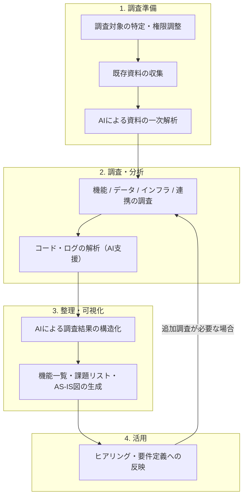

# 既存システム調査：AI活用方法

既存システムの調査では「ドキュメントの解読」「コード・ログの分析」「結果の整理」という膨大な作業が伴います。AIを「高速解析エンジン」として活用することで、属人化したナレッジを短期間で構造化し、要件定義の精度と速度を同時に高めます。

---

## なぜ既存システム調査が必要か

### 調査の目的と3つの効果
既存システム調査の目的は、新システムの開発に先立ち、「現実に基づいた」要件定義の土台を作ることです。この調査で得られる効果は次の3つに集約されます。

| # | 効果 | 内容 |
| :--- | :--- | :--- |
| **① 顕在課題と要求の把握** | 現行システムの問題点（障害・不満・属人化など）を可視化し、それに対応する改善要求を整理する |
| **② 網羅されていない機能の把握** | 今のシステムでは対応できていない業務ニーズ（未実装・回避策で運用中）を明らかにし、新規機能要求の根拠にする |
| **③ 非機能要求の基礎情報収集** | プラットフォーム・性能・連携仕様などの技術的前提を把握し、非機能要件定義のインプットにする |

---

### 手順：3つの効果を得るための調査の進め方

#### ① 顕在課題と要求の把握
調査対象：障害履歴、ユーザー問い合わせ記録、改善要望書、運用手順（特に「例外対応」の手順）

1. ドキュメントと運用実態の差分を抽出（「設計通りでない運用」＝潜在的な問題）
2. 障害・エラーの発生箇所と頻度をパターン分類
3. 回避策として運用している業務プロセス（本来システムでやるべきことを手作業でやっている箇所）を特定
4. 各問題に対し「どう直してほしいか」という要求を仮説として記述する

> **AIの活用ポイント**: 障害履歴・問い合わせ記録をAIに投入し、問題を「機能/データ/性能/操作性」の観点で自動分類させ、改善要求の仮説を生成させます。

#### ② 網羅されていない機能の把握
調査対象：機能一覧、ユーザーからの追加要望、現場のスプレッドシート・Excelファイル

1. 現行システムの機能一覧を作成（設計書+実機確認）
2. ユーザーが現在利用しているExcel・手作業ツールを洗い出す（＝システム外で行われている業務）
3. 業種・競合製品の標準機能と現行機能を比較し、未実装の一般的な機能を特定
4. 各不足機能を「必須（Must）/ あれば便利（Want）/ 将来対応」に分類する

> **AIの活用ポイント**: 業務内容を説明したうえで「この業務に必要な一般的なシステム機能を網羅的にリストアップし、現行機能一覧と照合して抜けているものを示してください」と指示します。

#### ③ 非機能要求の基礎情報収集
調査対象：インフラ構成図、性能ログ（監視ツール）、連携仕様書、法規制・社内規程

1. 現行のプラットフォーム（OS、DB、ミドルウェアのバージョン）を記録
2. ピーク時のアクセス数・レスポンスタイム・バッチ処理時間を測定または記録から取得
3. 外部連携先の一覧・方式（API/ファイル/DB直接）・データ仕様を整理
4. 適用が必要な法規制・セキュリティポリシー・SLA要件を収集する

> **AIの活用ポイント**: システム構成図と性能ログをAIに投入し、「このシステムを刷新する際に考慮すべき非機能要件の観点と現状のスペックをまとめてください」と指示します。

---

### ゴール定義（成果物）：調査完了の基準

調査終了条件を事前に合意することで、「いつまでも終わらない調査」を防ぎます。

| 効果 | 最終成果物 | 完了の目安 |
| :--- | :--- | :--- |
| **① 顕在課題と要求** | **問題点・改善要求リスト** | 各問題が「カテゴリ / 課題内容 / ビジネスへの影響 / 改善要求」の形式で整理されている |
| **② 網羅されていない機能** | **機能ギャップ分析表** | 現行機能一覧と対比し、「未対応 / 回避策運用 / 新規必要」の仕分けが完了している |
| **③ 非機能情報** | **現行システムスペックシート** | プラットフォーム・性能・連携・セキュリティの現状値が記録されており、要件定義に投入できる状態 |


---

## 1. 既存システム調査プロセスの全体像



---

## 2. 調査準備フェーズ：AIによるインプット分析

調査の品質は「何を調べるか」の設計で9割が決まります。AIを使って調査観点と仮説を事前に設計します。

### 2-1. 必要となるインプット資料
| カテゴリ | 資料の種類 | AIへの投入目的 |
| :--- | :--- | :--- |
| **機能・仕様** | 基本設計書、画面仕様書、API仕様書 | 機能一覧の初期生成と現状把握 |
| **データ** | ER図、DB定義書、データ移行計画書 | データ構造の理解と移行リスクの洗い出し |
| **運用** | 障害履歴、運用手順書、パッチ適用履歴 | 既知の問題点・技術的負債の抽出 |
| **定性** | 過去のヒアリング議事録、改善要望書 | ユーザーの不満・潜在ニーズの発掘 |

### 2-2. AIによる3つの事前成果物
| 成果物 | AIの役割 | 成果物イメージ |
| :--- | :--- | :--- |
| **① 機能一覧（初期版）** | 設計書から画面・バッチ・API一覧をテーブルで抽出 | [イメージを見る](#成果物イメージ機能一覧) |
| **② 技術的負債リスト** | 障害履歴・運用手順書から課題を抽出・分類 | [イメージを見る](#成果物イメージ技術的負債) |
| **③ 調査チェックリスト** | 調査観点・確認方法を自動生成 | [イメージを見る](#成果物イメージチェックリスト) |

---

## 3. 実践プロンプト集 & 成果物イメージ

### A. ドキュメント解析・機能一覧の抽出
<details>
<summary>プロンプトと成果物イメージを表示</summary>

#### プロンプト
```text
あなたはシステム移行プロジェクトの経験豊富なビジネスアナリストです。
以下のシステム設計書を読み込み、現行システムの機能を整理してください。

【資料】
{設計書・画面仕様書・API仕様書などを貼り付け}

【出力形式】
1. 機能一覧（テーブル形式）
   - 列：機能ID / カテゴリ（画面/バッチ/API）/ 機能名 / 概要 / 主要な業務ルール
2. ドキュメント化されていない暗黙のルールや注意事項（可能な範囲で推測）
3. ドキュメントの陳腐化疑念箇所（矛盾・不明点のリスト）
```

<a id="成果物イメージ機能一覧"></a>
#### 成果物イメージ
| 機能ID | カテゴリ | 機能名 | 概要 | 主要業務ルール |
| :--- | :--- | :--- | :--- | :--- |
| F-001 | 画面 | 受注入力 | 受注情報の登録・更新 | 単価は得意先マスタの価格ランクを参照 |
| B-001 | バッチ | 在庫引当バッチ | 夜間に全未引当注文を処理 | 特急フラグありは昼間の手動実行も可 |

> **2. 暗黙ルールの推測**
> - 受注入力画面で「単価手入力」フィールドがある → 特定ユーザーが手動上書きしている可能性あり（要確認）

> **3. ドキュメント不整合箇所**
> - 設計書v2.3では承認フローは「課長→部長」だが、v2.5では「課長」のみ。最新版の確認が必要。
</details>

### B. 技術的負債の抽出
<details>
<summary>プロンプトと成果物イメージを表示</summary>

#### プロンプト
```text
あなたはITアーキテクトです。
以下の資料から現行システムの技術的負債・課題を分析してください。

【資料】
{障害履歴・運用手順書・改善要望書などを貼り付け}

【出力形式】
以下のカテゴリで分類し、テーブル形式で出力してください。
- 列：No. / カテゴリ / 課題内容 / ビジネスへの影響 / 優先度（高/中/低）
- カテゴリ: 機能的負債 / アーキテクチャ負債 / データ負債 / 運用負債
```

<a id="成果物イメージ技術的負債"></a>
#### 成果物イメージ
| No. | カテゴリ | 課題内容 | ビジネスへの影響 | 優先度 |
| :--- | :--- | :--- | :--- | :--- |
| 1 | 機能的負債 | 複数の似た機能が別々に実装されており、変更時に漏れが発生しやすい | 障害リスク・保守コスト増大 | 高 |
| 2 | データ負債 | 顧客マスタの住所項目が旧フォーマット/新フォーマット混在 | データ移行時に変換処理が必要 | 高 |
| 3 | 運用負債 | 月末バッチ実行後、手動でのデータパッチが恒常化 | 担当者への属人化、ミスリスク | 中 |
</details>

### C. コード・ロジックの解析
<details>
<summary>プロンプトと成果物イメージを表示</summary>

#### プロンプト
```text
あなたは経験豊富なシステムエンジニアです。
以下のソースコードを読み込み、このモジュールで実装されている業務ロジックを仕様書形式で説明してください。

【ソースコード】
{解析対象のコードを貼り付け}

【出力形式】
1. このモジュールの目的（1〜3行）
2. 処理フロー（箇条書き or テーブル）
3. 実装されている主要な業務ルール・条件分岐の一覧
4. 外部依存（呼び出しているAPI、DB、他モジュール等）
5. ハードコーディングされている値・定数（要確認項目として）
```

#### 成果物イメージ
> **1. モジュールの目的**: 受注番号採番処理。年度・会社コードを前置したゼロ埋め8桁の連番を発行する。
> **2. 主要な業務ルール**
> - 会計年度が変わる4月1日0時に採番シーケンスをリセットする
> - 同一トランザクション内での採番衝突を防ぐため悲観的ロックを使用
> **3. ハードコーディング箇所（要確認）**
> - 会社コード "001" が定数として埋め込まれている（多会社対応時に要修正）
</details>

### D. 調査チェックリストの自動生成
<details>
<summary>プロンプトと成果物イメージを表示</summary>

#### プロンプト
```text
あなたはシステム刷新プロジェクトの経験豊富なプロジェクトマネージャーです。
以下の前提情報をもとに、既存システム調査のチェックリストを生成してください。

【前提情報】
- プロジェクト種別: [例：レガシー刷新 / パッケージ導入 / クラウド移行]
- 調査フェーズ: [例：要件定義前の現状調査]
- 調査対象業務: [入力]

【出力形式】
テーブル形式で以下の4列を出力してください。
- No. / 調査カテゴリ / 調査項目 / 確認方法 / 優先度（高/中/低）
調査カテゴリ: 機能 / データ / インフラ・非機能 / 外部連携 / 運用・保守
```

<a id="成果物イメージチェックリスト"></a>
#### 成果物イメージ
| No. | カテゴリ | 調査項目 | 確認方法 | 優先度 |
| :--- | :--- | :--- | :--- | :--- |
| 1 | 機能 | 全画面・バッチ・API一覧の作成 | 設計書 / 実機操作 | 高 |
| 2 | データ | 主要テーブルのレコード数・増加傾向の確認 | SQLクエリ / DB管理ツール | 高 |
| 3 | 外部連携 | 連携先一覧と連携方式（API/ファイル等）の確認 | 設計書 / インフラ担当者 | 高 |
| 4 | 運用 | 既知の技術的負債のリストアップ | 開発チームへのヒアリング | 中 |
| 5 | インフラ | 性能データ（レスポンスタイム・ピーク時）の収集 | 監視ツール / ログ解析 | 中 |
</details>

---

## 4. 詳細手順（Deep Dive）

### 4-1. 調査結果の構造化（大量ドキュメントへの対応）
設計書が数百ページあるケースでは、AIへの投入を以下のように分割して行います。
1. **分割投入**: 章・機能カテゴリ単位で資料を投入し、部分的な一覧を生成させる。
2. **統合**: 複数の部分的な一覧をまとめてAIに与え、重複排除・統合させる。
3. **矛盾検出**: 統合後の一覧を元に、「他のドキュメントとの矛盾点を探せ」と指示する。

### 4-2. ログ分析による実利用状況の把握
「設計書に書いてある機能」ではなく「実際に使われている機能」を見極めるためのアプローチです。

```text
以下のアクセスログ/エラーログを分析し、利用状況をまとめてください。

【ログ】
{ログデータを貼り付け}

【出力】
1. アクセス頻度が高いURLまたは機能（上位10件）
2. 頻発しているエラーコードとその推定原因
3. アクセスが著しく少ない（または皆無の）機能（廃止候補）
```

### 4-3. AIを使ったリバースエンジニアリング（ER図の自動生成）
DB定義書（DDL等）からER図のMermaid記法を自動生成させます。

```text
以下のDDL（テーブル定義SQL）から、主要なテーブル間の関連を示すER図をMermaid形式で作成してください。
外部キーが明示されていない場合は、カラム名から関連を推測し、「推測」と注釈をつけてください。
```

---

## 5. 最終成果物のフォーマット & サンプルイメージ

調査プロセスで作成すべき3つの成果物の定義とサンプルです。これらが揃った状態が、調査完了の基準となります。

---

### 成果物① 問題点・改善要求リスト

#### 用途
現行システムの顕在化した問題を整理し、それに対応する改善要求を要件定義のインプットとします。ヒアリングで仮説を提示する際の根拠としても活用します。

#### フォーマット定義
| 列名 | 説明 |
| :--- | :--- |
| **No.** | 通し番号 |
| **カテゴリ** | 機能 / データ / 性能 / 操作性 / 運用 |
| **問題の内容** | 現状起きている問題を具体的に記述 |
| **発生頻度** | 常時 / 月次 / 不定期 |
| **ビジネスへの影響** | 業務停止リスク・コスト・ユーザー負担など |
| **改善要求（仮説）** | 新システムで解決すべき要求の方向性 |
| **確認状況** | 仮説 / ヒアリング確認済 / 確定 |

#### サンプルイメージ
| No. | カテゴリ | 問題の内容 | 発生頻度 | ビジネスへの影響 | 改善要求（仮説） | 確認状況 |
| :--- | :--- | :--- | :--- | :--- | :--- | :--- |
| 1 | 機能 | 受注入力時に在庫確認画面を別途開く必要があり、入力に時間がかかる | 常時 | 1件あたり約3分の余分な操作が発生 | 受注入力画面内でリアルタイムに在庫を表示する | ヒアリング確認済 |
| 2 | データ | 顧客マスタの住所が旧・新フォーマット混在で、帳票出力時に文字化けが発生 | 月次 | 帳票再出力による工数増加、顧客への送付遅延 | データ移行時に住所フォーマットを統一する | 仮説 |
| 3 | 運用 | 月末の締めバッチ後、担当者が手動でデータ補正（担当者のみが手順を把握） | 月次 | 担当者不在時に業務停止リスク | バッチ処理の自動化・エラー自動補正、手順書の整備 | ヒアリング確認済 |

---

### 成果物② 機能ギャップ分析表

#### 用途
「現行機能×業務ニーズ」を対比することで、新システムで新規に対応が必要な機能（スコープ）を明確にします。開発規模の見積もりの根拠にもなります。

#### フォーマット定義
| 列名 | 説明 |
| :--- | :--- |
| **No.** | 通し番号 |
| **業務カテゴリ** | 受発注・在庫管理・請求など |
| **業務ニーズ / 要望** | ユーザーが実現したいこと |
| **現行システムの対応状況** | 対応済 / 部分対応（Excelで補完）/ 未対応 |
| **ギャップの根拠** | ヒアリング / Excelファイルの発見 / 改善要望書 など |
| **新システムへの対応方針** | 必須（Must）/ あれば便利（Want）/ 将来対応 / 対応しない |

#### サンプルイメージ
| No. | 業務カテゴリ | 業務ニーズ / 要望 | 現行の対応状況 | ギャップの根拠 | 対応方針 |
| :--- | :--- | :--- | :--- | :--- | :--- |
| 1 | 受注管理 | 承認状況をリアルタイムで確認したい | 未対応（メールで個別確認） | ヒアリング、メール大量発生が確認された | Must |
| 2 | 在庫管理 | ロット単位での在庫追跡ができること | 部分対応（Excelで管理） | 担当者作成のExcelファイル（lot_track.xlsx）を発見 | Must |
| 3 | 分析・レポート | 売上トレンドのグラフをダッシュボードで確認したい | 未対応（BIツールで個人が作成） | 改善要望書 No.12 | Want |
| 4 | 受注管理 | EDIによる受注データの自動取り込み | 未対応（FAXを手動入力） | ヒアリング（大口顧客はEDI希望） | Must |

---

### 成果物③ 現行システムスペックシート

#### 用途
非機能要件定義のベースラインを確立するための現行システムの技術情報サマリーです。新システムの性能目標・プラットフォーム選定・連携方式検討の根拠となります。

#### フォーマット定義と記入例

## 現行システム スペックシート
更新日: YYYY/MM/DD　作成者: [氏名]

### 1. プラットフォーム
| 項目 | 現行の内容 | 備考 |
| :--- | :--- | :--- |
| OS | Windows Server 2016 | 2026年サポート終了予定 |
| Webサーバー | IIS 10.0 | |
| APサーバー | Java 8 (Tomcat 9) | Java 8 EOL: 2030年3月 |
| DBサーバー | Oracle Database 19c | |
| フロントエンド | JSP + JavaScript (jQuery) | |

### 2. 性能特性（現状値）
| 項目 | 現行の値 | 計測方法 |
| :--- | :--- | :--- |
| 同時接続ユーザー数（平常時） | 約50名 | 監視ツール実績 |
| 同時接続ユーザー数（ピーク時） | 約120名（月末） | 監視ツール実績 |
| 画面の平均レスポンスタイム | 1.2秒（平常時）/ 4.5秒（ピーク時） | 監視ツール実績 |
| 月次バッチ処理時間 | 約3時間（月末深夜） | 運用ログ |
| データ量（主要テーブル） | 受注テーブル: 約500万件 / 年間増加: 約60万件 | SQL実行結果 |

### 3. 外部連携一覧
| 連携先 | 連携方式 | データ形式 | 頻度 | 備考 |
| :--- | :--- | :--- | :--- | :--- |
| 物流会社A | SFTP（ファイル連携） | CSV | 日次 | フォーマット固定、変更要交渉 |
| 会計システム | DB直接連携 | - | リアルタイム | 疎結合化が望ましい（要検討） |
| EDI（大口顧客X社） | JCA手順 | 固定長テキスト | 随時 | 新システムでの継続要否を確認 |

### 4. セキュリティ・コンプライアンス
| 項目 | 現行の内容 |
| :--- | :--- |
| 認証方式 | ID/パスワード（シングルサインオン: なし） |
| 通信暗号化 | HTTPS（TLS 1.2） |
| 適用法規制 | 電子帳簿保存法、個人情報保護法 |
| データ保存期間 | 受注データ: 7年、ログ: 1年 |


---

## 6. リファレンス

- 🔗 [既存システム調査：手法詳細](./手法詳細.md)
