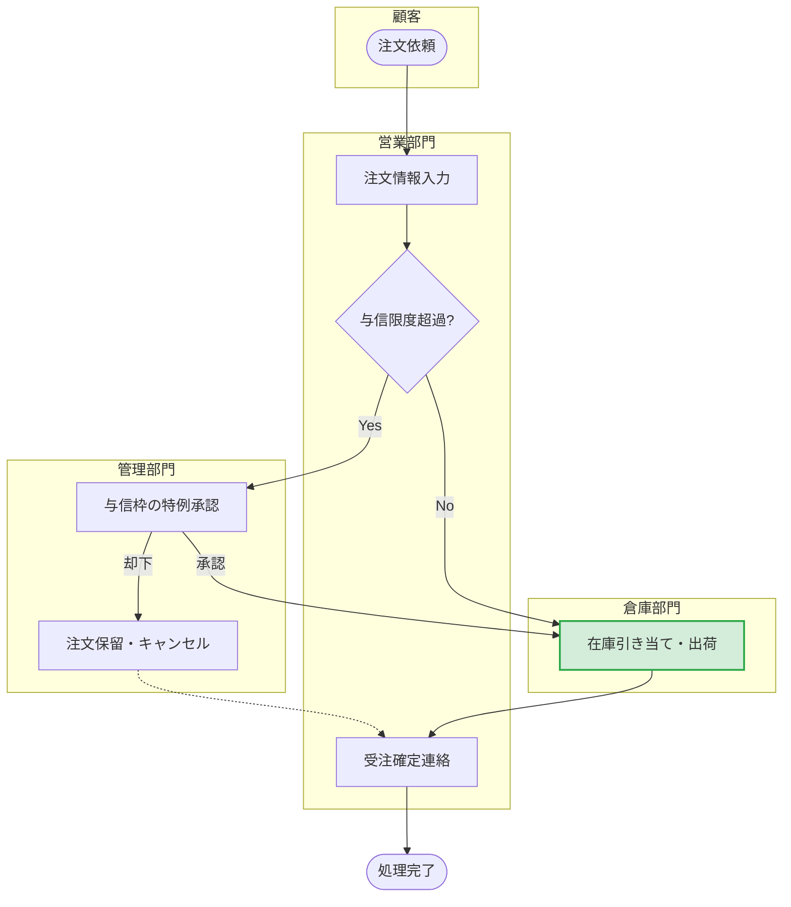

# 生成AIを使った業務フロー図の作成手法

## 概要
本ドキュメントでは、生成AIとコードベースの描画ツールを組み合わせることで、**「図形の配置・整列」といったお絵かき作業の時間をゼロ**にし、「業務の論理構造化」にのみ集中するための業務フロー図作成手法を解説します。

---

## 1. 推奨するツール構成

- **生成エンジン（LLM）**: ChatGPT (GPT-4o), Claude 3.5 Sonnet など
  - 論理的な構造化とコード生成能力に優れるモデルを使用します。
- **レンダリング（描画）ツール**: **Mermaid.js** または **PlantUML**
  - テキストコードから図を自動生成するツール。Obsidian, Notion, GitHubなどでネイティブサポートされているため、別ツールを開く必要がありません。
  - **💡 補足（Google Driveとの連携）**: 組織でGoogle Workspaceを利用している場合、**diagrams.net（旧draw.io）** をGoogle Driveアプリとして追加することで、Drive上で直接Mermaidコードからフロー図を生成・保存・共有することが可能です（メニューの「配置」>「挿入」>「高度な設定」>「Mermaid」からコードを貼り付けます）。

---

## 2. 最速でフロー図を作る3ステップ

### Step 1: 業務の「事実」だけをテキストで箇条書きにする
最初から綺麗な図を頭で描く必要はありません。マニュアルの文章や、ヒアリング時の汚いメモ書きなど、「誰が・いつ・何をするか」という要素だけを用意します。

### Step 2: AIに「Mermaidコード」へ変換させる
LLMに文章を渡し、スイムレーン付きのフローチャートのコードを生成させます。

**【基本プロンプト】**
```text
あなたは業務プロセスの可視化エキスパートです。
以下の「業務のメモ」をもとに、Mermaid記法のフローチャート（flowchart TD）で業務フロー図を作成してください。

【ルール】
- 担当者・部門ごとに `subgraph`（スイムレーン）を分けて配置すること
- 処理の開始と終了ノードを明確にすること
- 判断分岐（Yes/No）がある場合はひし形ノードを使用し、矢印にYes/Noを明記すること
- 各図形のテキストは長すぎないよう、簡潔に要約すること

【業務のメモ】
{ここに箇条書きメモやマニュアル文章を貼り付け}
```

### Step 3: エディタに貼り付けてプレビュー・微修正
生成されたコード（````mermaid ... ````）をObsidian等のエディタに直接貼り付けます。
AIは時折ノードの矢印の向き（`-->`）を間違えたり、名前が長すぎたりすることがあるため、コードを直接数文字書き換えて微修正します。

> **💡 メリット**: マウス操作で図形を動かして位置を調整したり、矢印を繋ぎ直したりする「デザインの微調整」工数が完全に不要になります。

---

## 3. さらに質を高める応用Tips

### ① 「暗黙の前提」や「異常系」をAIに推論させる
メモに書かれていない例外処理（例：「もし在庫がなかったらどうする？」）をAIに考えさせることで、フローの穴を埋めることができます。

**追加プロンプト例：**
> 「この業務フローにおいて、記載されていないが実務上発生しうる『異常系のルート（例：エラー時、差し戻し時）』があれば、仮説として点線の矢印（`-.->`）で追加し、理由を添えてください。」

### ② 「表（テーブル）」とのハイブリッド出力
図だけでは詳細な手順や利用するツール名などを表現しきれない場合があるため、一覧表とセットで出力させると実用的なマニュアル・要件定義書になります。

**追加プロンプト例：**
> 「Mermaidのコード出力に加え、以下の列を持つ業務ステップの詳細テーブルを出力してください。
> （列：No / 担当者 / ステップ名 / 詳細な作業内容 / 想定される利用ツール）」

### ③ AS-IS（現状）とTO-BE（理想）の差分可視化
業務改善の提案資料を作る際、既存フローと新フローの差分を色付けしてハイライトさせると効果的です。

**追加プロンプト例：**
> 「現状のフロー（AS-IS）と改善後のフロー（TO-BE）の2つのMermaidコードを出力してください。
> TO-BEのフローでは、新システムによって『自動化されるノード』と『新規追加されるノード』に対し、Mermaidの `style` 記法を用いて背景色を変更し、目立つようにしてください。」

---

## 4. 実際の成果物イメージ

以下は、この手法を用いて生成されたMermaidのスイムレーン図の描画例です。


