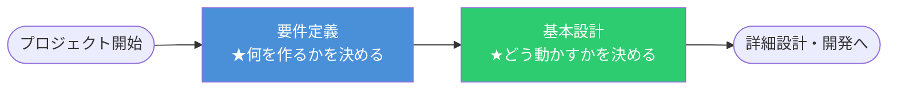
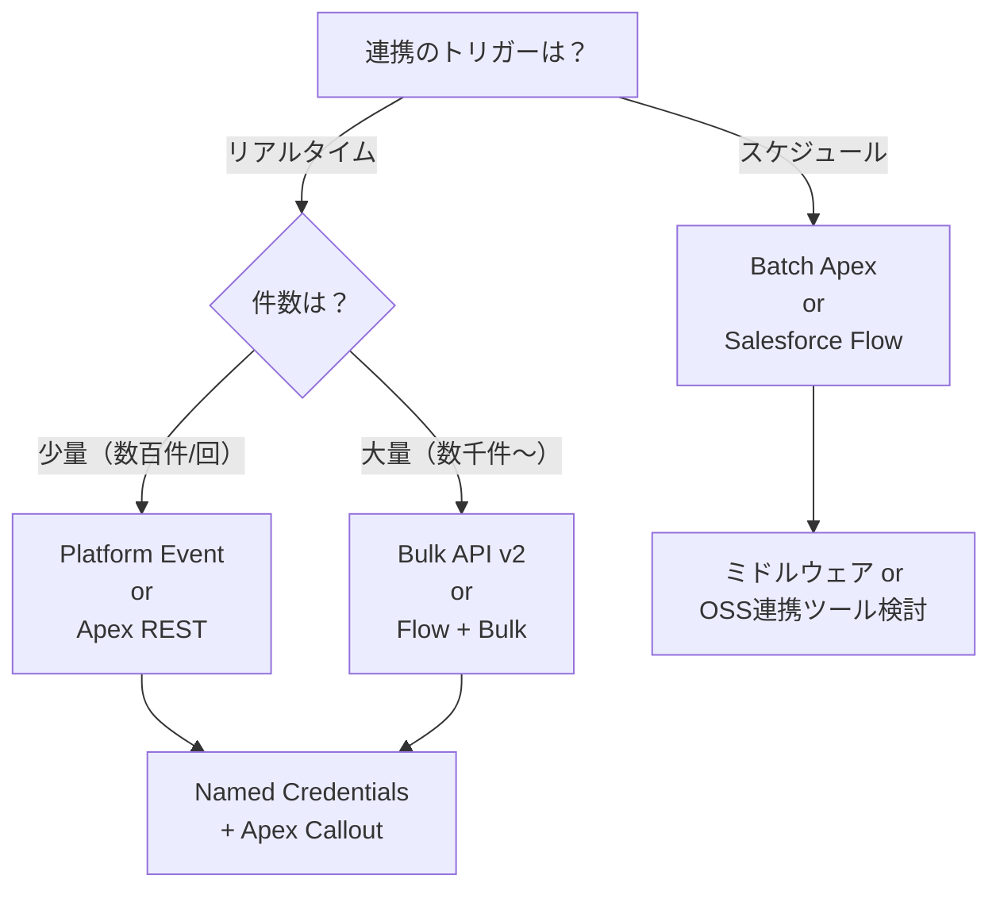

# 要件定義・基本設計フェーズ 実践ガイド（Salesforceデータ連携開発）

> **このドキュメントの目的**：ベンダーSE/PLとして、Salesforceデータ連携案件の要件定義〜基本設計フェーズを主導するための「ゴール・成果物・実際の進め方」を整理する。

---

## 📌 このフェーズの全体ゴール



| フェーズ | ゴール | 一言 |
|:---|:---|:---|
| **要件定義** | 「何を作るか」を顧客と合意する | 機能・非機能・制約の全量をテーブルに並べる |
| **基本設計** | 「どう動かすか」の方針を設計する | IF構成・認証・フロー・エラー方針を文書化する |

---

## 📦 フェーズの成果物一覧

### 要件定義フェーズ

| 成果物 | 目的 | 承認者 |
|:---|:---|:---:|
| **インタフェース一覧（IF一覧）** | どのシステム間で何を連携するかを網羅する | 顧客PM |
| **非機能要件定義書** | セキュリティ・ボリューム・可用性の合意 | 顧客PM + アーキテクト |
| **用語集・コード変換一覧** | 業務コード・マスタ名称の対応を定義する | 顧客業務担当 |
| **スコープ確認書** | 対象外事項の明確化（重要！） | 顧客PM |

### 基本設計フェーズ

| 成果物 | 目的 | 承認者 |
|:---|:---|:---:|
| **基本設計書（連携方式定義）** | 連携手段（API/Bulk/CDC等）と実行タイミングを定義 | アーキテクト |
| **認証・セキュリティ設計書** | OAuth2.0フロー・Named Credentialsの設計 | セキュリティ担当 |
| **エラーハンドリング方針書** | リトライ方針・アラート通知・リカバリ手順 | 顧客PM + 運用担当 |
| **データマッピング表（詳細版）** | 項目レベルの変換ロジック全量を記載 | 顧客業務担当 |

---

## 🏃 実践的な進め方（ベンダー主導）

### ステップ1：キックオフで「連携の地図」を描く

最初のミーティングで以下を確認する。場当たり的なヒアリングを防ぎ、抜け漏れをゼロにするための「地図」を最初に作る。

```
確認すること
├── 接続するシステムのリスト（SFから見てIn/Out？双方向？）
├── トリガー（リアルタイム / バッチ / 手動）
├── 業務上の優先度（失敗時に業務が止まるか？）
└── 納期・マイルストーン
```

> ⚠️ **ベンダー主導のポイント**: 顧客は「どう作るか」は知らなくて当然。「何が必要ですか？」ではなく、「こちらから選択肢を提示して選んでもらう」スタイルで進める。

---

### ステップ2：ヒアリングシートで全量を集める

各インタフェースについて、以下の項目を1シート1IFで明文化する。

#### 各IFのヒアリング必須項目

```
① ビジネス目的（なぜこの連携が必要か）
② 連携方向（送信元 → 送信先、単方向 or 双方向）
③ 実行タイミング（リアルタイム / スケジュール: 頻度は？）
④ 対象データ量（1回あたりの件数、1日の最大件数）
⑤ 項目マッピング（どの項目をどのように変換するか）
⑥ 認証方式（相手システムの認証はどのタイプか）
⑦ エラー時の対応方針（再送するか / 担当者通知か）
⑧ 非機能要件（応答時間、SLA、データ保持期間）
```

---

### ステップ3：スコープ確認を必ずセットで行う

「作ること」と同じくらい重要なのが「**作らないこと**」の合意。

| 確認観点 | 例 |
|:---|:---|
| 対象外システム | 「△△シムスとの連携はフェーズ2以降」 |
| 対象外機能 | 「削除データの同期は対象外」 |
| 運用保守の範囲 | 「認証トークンのローテーションはお客様対応」 |

> 💡 **なぜ重要か**: スコープの曖昧さが後工程の追加要件・炎上の最大原因になるため、この段階で文書化・署名をもらう。

---

### ステップ4：基本設計での連携方式の決定

要件をもとに、Salesforceとしての最適な連携方式を決定する。



---

### ステップ5：非機能要件のドラフトを「先手で」提示する

顧客は非機能要件を言語化するのが苦手なことが多い。ベンダー側から**ドラフトを提示して赤入れしてもらう**スタイルが効率的。

**提示するドラフトの例**

```markdown
## 非機能要件（Draft v1.0）

| 項目 | 提案値 | 備考 |
|:---|:---|:---|
| API応答時間（P95） | 3秒以内 | Bulk APIを除く |
| バッチ実行許容時間 | 30分以内 | 夜間バッチ |
| 可用性目標 | 99.5%（年間44時間以内の停止）| Salesforce本体のSLAに準拠 |
| エラー通知 | Slackチャンネル + メール | 重大度によって通知先を変える |
| データ保持期間 | 連携ログ90日 | 監査ログ1年 |
| 認証方式 | OAuth 2.0 Client Credentials | 全IFで統一 |
```

---

### ステップ6：フェーズ完了の判断基準（Definition of Done）

以下がすべて満たされたら、基本設計フェーズ完了とする。

- [ ] IF一覧が全件埋まっており、顧客押印または承認コメントがある
- [ ] 各IFの連携方式・タイミング・エラー方針が基本設計書に記載されている
- [ ] 非機能要件定義書が顧客と合意されている
- [ ] スコープ確認書で「対象外」が明文化されている
- [ ] データマッピング表の項目レベルの内容を顧客業務担当者が確認している
- [ ] 認証・セキュリティ設計方針が決定している
