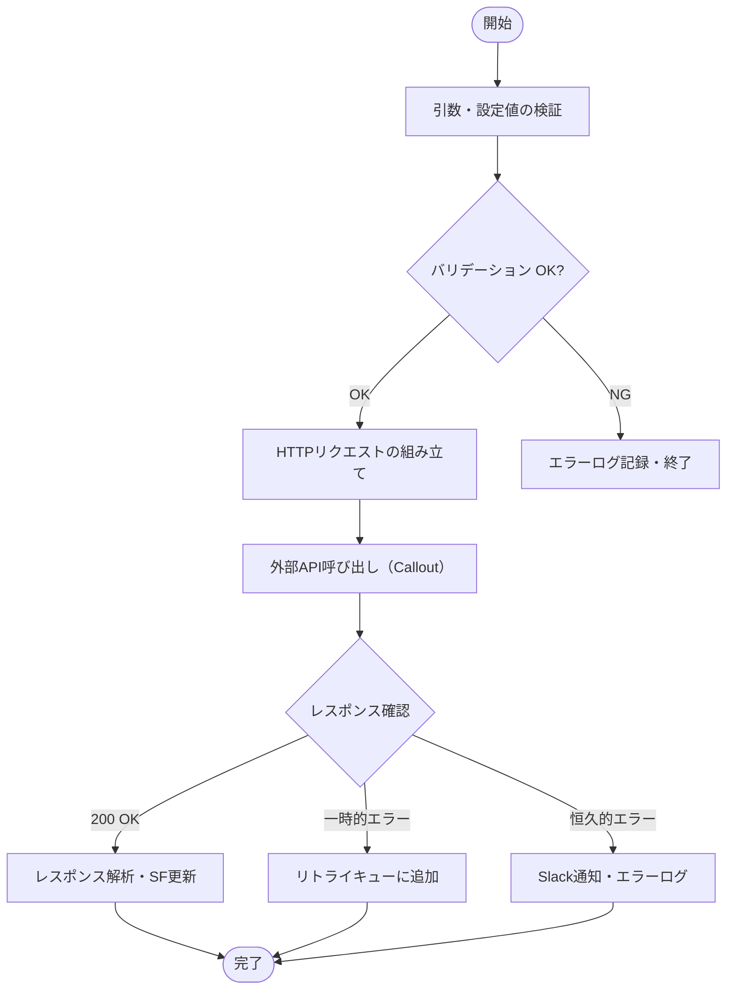

# プログラム詳細設計書（テンプレート）

## プロジェクト情報
- **プロジェクト名**：
- **対象IF / クラス名**：
- **作成日**：　　　　 / 最終更新：
- **作成者**：　　　　　/ レビュー者：
- **バージョン**：v1.0

---

## 1. 概要

| 項目 | 内容 |
|:---|:---|
| **クラス名** |  |
| **種別** | □ Apex Class  □ Batch Apex  □ Scheduled Apex  □ Flow  □ その他 |
| **目的** |  |
| **関連IF-ID** | IF-001, IF-002 |

---

## 2. 処理フロー

---

## 3. メソッド一覧

| メソッド名 | 引数 | 戻り値 | 処理概要 |
|:---|:---|:---|:---|
| `execute()` |  | `void` | メイン処理の起点 |
| `buildRequest()` | `List<SObject>` | `HttpRequest` | リクエストボディの組み立て |
| `parseResponse()` | `String` | `List<SObject>` | レスポンスJSONの解析 |
| `handleError()` | `HttpResponse` | `void` | エラー種別の判定と通知 |

---

## 4. エラーハンドリング詳細

| エラー種別 | HTTPステータス / 例外 | 対応 | 再試行 |
|:---|:---:|:---|:---:|
| タイムアウト | `CalloutException` | リトライキュー追加 | ◯（最大3回） |
| 認証エラー | 401, 403 | Fatal ログ + Slack通知 | ✕ |
| サーバーエラー | 500, 503 | Retryableログ | ◯（最大3回） |
| データ不正 | 400 | Fatal ログ + メール通知 | ✕ |

---

## 5. 外部依存・設定値

| 項目 | 設定場所 | 値・参照先 |
|:---|:---|:---|
| エンドポイント | Named Credential | `NC_{システム名}` |
| 認証トークン | Named Credential | OAuth 2.0 自動管理 |
| タイムアウト設定 | Custom Metadata | `SFInteg_Config__mdt` |
| 接続先URL（環境別） | Custom Metadata | 環境ごとに切り替え |

---

## 6. テスト設計

| テストケース | 分類 | 期待結果 |
|:---|:---:|:---|
| 正常レスポンス（200 OK） | 正常系 | SF側のレコードが更新される |
| タイムアウト（CalloutException） | 異常系 | リトライキューに追加される |
| 認証エラー（401） | 異常系 | エラーログが登録される |
| データ不正（400） | 異常系 | Slackに通知が送信される |

---

## 7. 変更履歴

| バージョン | 変更日 | 変更者 | 変更内容 |
|:---:|:---:|:---:|:---|
| v1.0 |  |  | 初版作成 |
