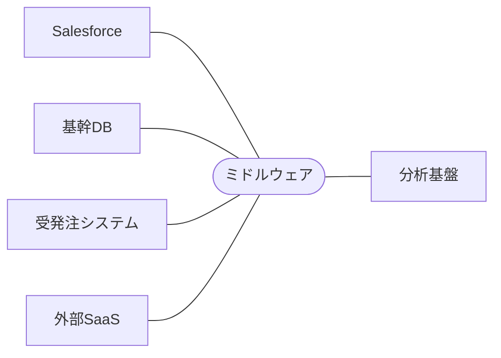

# 01｜P2P連携とミドルウェア連携の比較

> **一言で言うと**: システム数が増えるにつれ、直接つなぐ方式（P2P）はどんどん破綻していく。ミドルウェアはその「複雑さ」を一手に引き受けてくれる中継役。

## 🔗 P2P（ポイント・ツー・ポイント）連携

システムを「直接」API・DB接続でつなぐ方式。間に何も挟まない。

```
SalesforceA ←──────→ 基幹DB
SalesforceA ←──────→ 受発注システム
SalesforceA ←──────→ 外部SaaS
基幹DB      ←──────→ 受発注システム
```

| | 内容 |
|:---|:---|
| ✅ **メリット** | 中間サーバー不要でコストが低い。シンプルで追いやすい |
| ❌ **デメリット** | システムが増えると連携ポイントが爆発的に増える（スパゲッティ化） |

### 🍝 スパゲッティ化とは？

連携するシステムの数を N とすると、必要な接続の数は **N×(N−1)÷2** で増えていく。

| システム数 | 接続数 |
|:---:|:---:|
| 3システム | 3 本 |
| 5システム | 10 本 |
| 10システム | 45 本 |

3〜5システムを超えたあたりで、「どのシステムがどれとつながっているか」がカオスになり、1本の修正が別の連携を壊す悪循環が生まれる。

---

## 🏗️ ミドルウェア（ハブ＆スポーク）連携

システムの**「中心」**にミドルウェアを置き、すべての通信をここ経由で行う方式。



| | 内容 |
|:---|:---|
| ✅ **メリット** | 各システムは「ミドルウェアとだけ話す」だけでよい。拡張しやすい |
| ✅ **メリット** | データ変換・プロトコル変換・リトライなどの共通処理を集約できる |
| ❌ **デメリット** | ライセンスや導入コストが高い |
| ❌ **デメリット** | ミドルウェア自体が単一障害点（SPOF）になりうる |

---

## 📋 どちらを選ぶべきか？

以下のいずれかに当てはまる場合は、**ミドルウェアの導入を検討**する。

- [ ] 連携対象のシステムが **3つ以上** ある（または今後増える見込み）
- [ ] 連携先がレガシーで、**プロトコルや形式の変換**が必要（SFTP・固定長・SOAPなど）
- [ ] Apexコード内に大量の**データマッピング・変換ロジック**を書きたくない
- [ ] 複数プロジェクトをまたいで**統合基盤を共通化**したい
