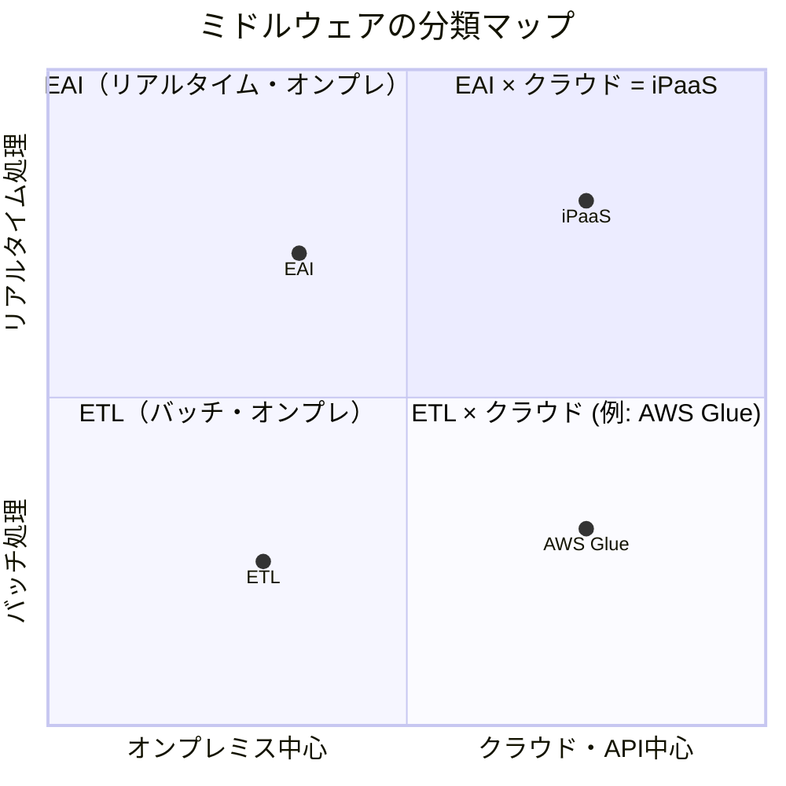

# 02｜ミドルウェアカテゴリの分類と特性

> **一言で言うと**: ミドルウェアには「リアルタイム系」「大量バッチ系」「クラウドAPI系」の3種類がある。自分の要件がどの軸に重いかで選ぶ。

## 🧭 分類の前提：2つの軸で考える

まずこの2つの軸を押さえると、どのカテゴリが自分の要件に合うか自然と絞れてくる。

| 軸 | 左（従来型） | 右（モダン型） |
|:---|:---|:---|
| **処理タイミング** | バッチ（夜間一括・大量） | リアルタイム（即時・イベント駆動） |
| **接続方式** | オンプレ・独自仕様（固定長ファイル・独自TCP等） | クラウド・Web API（REST/Webhook等） |

---

## 🏭 EAI（エンタープライズ・アプリケーション統合）

**→ リアルタイムに数件〜数千件のデータを連携したい。特にオンプレやレガシー系。**

例えばこんな場面で活躍する：
- Salesforceで「受注」に変わった瞬間、基幹システムへ即時に売上レコードを作成する
- メッセージキューを使ったシステム間の非同期メッセージング

| ポイント | 内容 |
|:---|:---|
| 強み | 異なるプロトコル・フォーマット間の変換（HTTP ⇔ SFTP など）が得意 |
| 弱み | 大量データの一括処理は不向き（ETLの方が向く） |
| 代表ツール | ASTERIA Warp、DataSpider、HULFT |

---

## 🔄 ETL（抽出・変換・ロード）

**→ 大量データを夜間などに一括で抽出・整形し、他システムへ流し込みたい。**

例えばこんな場面で活躍する：
- 古い基幹DBから毎夜200万件の顧客データを抽出し、クレンジングしてSalesforceへバルクロード
- 全社マスタデータをSnowflakeやBigQueryなどの分析基盤に集約する

| ポイント | 内容 |
|:---|:---|
| 強み | 大容量データのソート・集計・クレンジング処理に特化。メモリ効率が高い |
| 弱み | 即時連携は苦手。基本的に「ジョブ実行」型 |
| 代表ツール | Talend、Informatica、AWS Glue |

---

## ☁️ iPaaS（Integration Platform as a Service）

**→ Salesforceや各種SaaSをAPIでつなぎたい。現代のクラウド中心のアーキテクチャ。**

例えばこんな場面で活躍する：
- Salesforce・Slack・Jiraを組み合わせた自動化フロー（SaaS間オーケストレーション）
- MuleSoftで「再利用可能なAPI」として自社システムを公開し、各アプリが共通で呼び出せる仕組みにする

| ポイント | 内容 |
|:---|:---|
| 強み | SaaSの標準コネクタが豊富。API Gateway の機能も担える |
| 弱み | 高額なライセンス（特にMuleSoft）。オンプレとの親和性は低め |
| 代表ツール | MuleSoft、Workato、Boomi、Zapier / Make |

---

## 🗺️ 3カテゴリの早見表

| 比較観点 | EAI | ETL | iPaaS |
|:---|:---:|:---:|:---:|
| **処理タイミング** | リアルタイム | バッチ（夜間等） | リアルタイム |
| **得意なデータ量** | 少〜中（件単位） | 大（万〜百万件） | 少〜中（件単位） |
| **接続環境** | オンプレ中心 | オンプレ中心 | クラウド中心 |
| **実装コスト** | 中 | 中〜高 | 中〜高 |
| **推奨シーン** | レガシー統合・即時連携 | 大量データ移行・分析基盤連携 | SaaS間連携・API基盤構築 |
