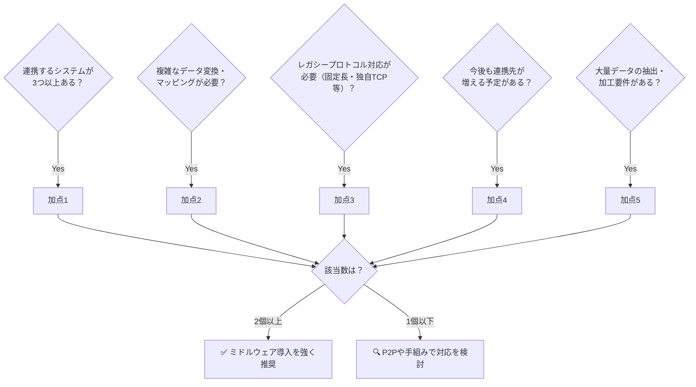

# 03｜ミドルウェア導入の費用対効果（ROI）と判断手順

> **一言で言うと**: ミドルウェアは高い。でも「入れなかった場合の未来」を試算・可視化すると、投資として正当化できることが多い。PLとして決裁者に説明できる状態を作る。

---

## ⚠️ 「入れなかった場合」のリスク（As-Is のコスト）

まず現状（ミドルウェアなし）を放置した場合に、**将来どんな痛みが発生するか**を整理する。これが導入の正当性の根拠になる。

| リスク | 具体的な痛み |
|:---|:---|
| 🔧 **改修コストの高騰** | 連携先が増えるたびにコードを修正。1箇所の変更が別の連携を壊すリスク |
| 👤 **属人化** | API管理・変換・リトライをApexに手書きすると、担当者が抜けたら誰も触れなくなる |
| 🔗 **密結合による可用性低下** | 1システムのダウンが隣のシステムに直撃する構造になる |

---

## ✅ 「入れるべき」かどうかの判断基準

以下のうち **2つ以上**当てはまる場合は、ミドルウェアの導入を強くすすめる。

---

## 💼 決裁者への「ROI」の訴え方

ミドルウェアのライセンス費は、**1プロジェクトの予算**だけで見ると高く見えてしまう。この視点の罠に入らいよう、以下の切り口で説明する。

### 工数の削減効果を数値化する
「手組み開発」と「ミドルウェアの設定作業」の工数を比較し、差分コストを数値（人月）で示す。  
例：「4連携をApexで作ると4人月かかるが、ミドルウェアなら1.5人月で済む」

### 全社の共通基盤として配賦する
今回1プロジェクトで調達しても、**別プロジェクト・別部署も使えるIT資産**として位置づけることで、ライセンス費用を複数プロジェクトに按分（配賦）して、個別の負担を下げる。

### TCO（総所有コスト）で見ると安い
初期費用は高くても、**5年間の保守コスト、障害対応コスト、人材コスト**と合算した場合に手組み開発の方が高くなるケースは多い。TCOで比較する資料を作ることが説得力を高める。
