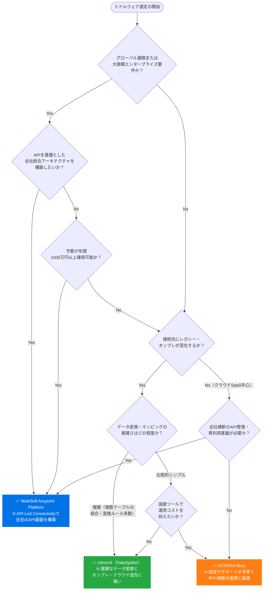

# 04｜ミドルウェア選定の判断フロー

> **一言で言うと**: 要件を「スケール」「接続対象」「コスト感」の3軸で整理し、MuleSoft・mitocoX・ASTERIAの中から最適な1本を選ぶ。

---

## 🔍 3ツールのポジショニング早見表

| 比較観点 | MuleSoft | mitocoX (DataSpider) | ASTERIA Warp |
|:---|:---:|:---:|:---:|
| **カテゴリ** | iPaaS（エンタープライズ級） | EAI（国産・中規模） | EAI（国産・中小〜中規模） |
| **ターゲット規模** | 大企業・グローバル | 中規模〜大企業 | 中小〜中規模 |
| **得意な接続先** | クラウドSaaS（APIベース） | オンプレ・クラウド混在 | オンプレ・レガシー系 |
| **ライセンスコスト** | 🔴 高額（年数千万〜） | 🟡 中程度（年数百万〜） | 🟢 比較的安価（年数十万〜） |
| **実装難易度** | 高（専門知識が必要） | 中（GUIベース） | 低〜中（GUIベース） |
| **Salesforce親和性** | 🌟 最高（同グループ） | 🌟 良好 | ◎ 良好 |
| **日本語サポート** | △（英語中心） | ◎（国産） | ◎（国産） |

---

## 🗺️ 判断フローチャート

---

## 🏢 各ツールの詳細プロファイル

### 🔵 MuleSoft Anypoint Platform

**こんなプロジェクトに向いている：**
- Salesforceを中心に、複数のクラウドSaaSを横断的に繋ぎたい（Salesforceの関連会社のため親和性が高い）
- 「APIとして公開して社内の複数チームが共通利用する」API駆動型アーキテクチャを構築したい
- グローバルや複数拠点にまたがる大規模な企業統合

**注意点：**
- ライセンスが非常に高額なため、1プロジェクト単独での費用対効果は出しにくい
- 専任のアーキテクト・運用担当が必要になることが多い

---

### 🟢 mitocoX（DataSpider）

**こんなプロジェクトに向いている：**
- オンプレ基幹システムとクラウドSaaSが混在した環境のデータ連携
- データの変換・マッピングルールが複雑で、柔軟な加工処理が必要
- Salesforceと国内の業務システム（ERP・会計システムなど）を繋ぐプロジェクト

**注意点：**
- 国産でサポートは手厚いが、非常に多機能なためエンジニアに一定の学習コストがかかる
- 大規模案件では「HULFT Square」など関連製品の組み合わせも検討する

---

### 🟠 ASTERIA Warp

**こんなプロジェクトに向いている：**
- 中小〜中規模の企業で、まずミドルウェアを導入して社内のシステム連携を一本化したい
- GUIベースのノーコード設定でエンジニアでない担当者でも運用したい
- コストを比較的抑えながら、Salesforce連携を素早く実現したい

**注意点：**
- 大規模エンタープライズ・グローバル要件には向かない
- 複雑なデータ変換処理が多い場合はmitocoXと比較して検討する

---

## 📋 選定の最終チェックリスト

ツールを絞り込んだあと、最終決定の前に以下を確認する。

- [ ] **PoC（概念実証）の実施**: 選定ツールのトライアル環境で、実際の連携要件を試せているか？
- [ ] **コネクタの確認**: 連携が必要な全システムに対応するコネクタが標準またはカスタムで利用可能か？
- [ ] **ベンダーサポート確認**: 国内のサポート体制（SLA・対応時間・日本語対応）は要件を満たしているか？
- [ ] **運用体制の整備**: 設定変更・障害対応を担当できるエンジニアがプロジェクト内にいるか？
- [ ] **ライセンス費の配賦設計**: 他プロジェクトへのライセンス費の按分計画（TCO削減）を立てているか？
