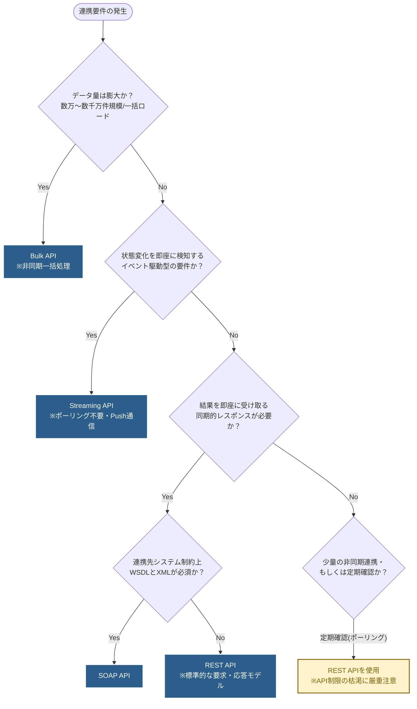

# 01｜API選定の判断フロー

## 概要
データ連携の要件（データ量、リアルタイム性、システム制約など）に基づいて、Salesforceが提供する最適なAPI（REST, SOAP, Bulk, Streaming）を決定するためのフローチャートおよび判断基準。

## 事前確認：接続先システムの制約
データ連携では、自システム（Salesforce）側のアプローチを決める前に、**「連携先（接続先）のシステムがどのような通信プロトコルやフォーマットを許容しているか」を真っ先に確認する**必要があります。

- **連携手段の制約**: 接続先が古いオンプレミス環境でSOAP（WSDL）しか受け付けない場合、必然的にSOAP APIが選定基準の土台となります。
- **処理能力の制約**: 接続先が一度に大量のデータ（メガバイト単位のJSON等）を処理できない場合、Bulk APIによる大規模一括連携を避け、REST API等で細かく分割送信する設計が必要になることがあります。

## 連携要件の整理手法（3つの軸）
接続先の制約がクリアになり、複数の技術的な選択肢が取れる場合は、要件を以下の3つの軸（件数・頻度・遅延許容度）で多角的に整理します。

| 軸 | 確認事項 | 選定への影響例 |
| :--- | :--- | :--- |
| **1. 件数 (Volume)** | 1回あたりの転送レコード数はどの程度か？ | 数万件を常時超える場合は「Bulk API」を最優先で検討する。 |
| **2. 頻度 (Frequency)** | リアルタイム、時間単位、日次など、どの頻度で連携が発生するか？ | 高頻度（ミリ秒〜数分単位）の場合は、APIリソースの枯渇を防ぐためにイベント駆動の「Streaming API（CDCやPlatform Events）」を検討する。 |
| **3. 遅延許容度 (Latency)** | データ発生から連携先へのシステム反映までに許されるタイムラグは？ | 即時反映とレスポンス確認が必要（結果を待機する）なら「REST/SOAP API」を、数分〜数時間の遅延が許容されるなら非同期の「Bulk/Streaming API」を検討する。 |

## API制限（ガバナ制限）の基本試算と設計
選定したAPIを用いたアーキテクチャにおいて、Salesforceの**「24時間あたりのAPIリクエスト上限」**に抵触しないかを設計フェーズで必ず試算・ドキュメント化します。

- **試算のポイント**: 
  - `(1日の発生レコード数 ÷ 1回のリクエストに含めるチャンク件数)` などを用いて、1日の想定APIコール数を算出し、設計書に明記する。
  - 試算の結果、上限値に対して余裕がない（例：50%以上に達する見込み）場合は、連携頻度（リアルタイム→日次バッチなど）の要件見直しや、Bulk APIへの変更を検討する。

## 判断フローチャート (Decision Tree)

## 各APIの選定基準と理由

### 1. 【Bulk API】を選ぶべきケース
- **主な要件**: 初期データ移行、夜間バッチ、数万件以上のデータ同期。
- **判断理由**: 大量のデータを非同期かつ並列で処理することに設計面・ガバナ制限面で特化しているため。RESTでループ処理するよりもAPIリミットを大幅に節約できる。

### 2. 【Streaming API】を選ぶべきケース
- **主な要件**: レコード変更の即時UI反映（コールセンター等）、他システムへの即時イベント通知（PUB/SUBモデル）。
- **判断理由**: 外部システムからSalesforceに対して変更有無を定期的に問い合わせる**「ポーリング処理」**は、SalesforceのAPIリミットを急速に枯渇させる原因となります。Streaming APIを用いると、変更が発生した瞬間だけ通知を行う**「イベント駆動（Push通信）」**が実現できるため、遅延を最小化しつつAPI消費の無駄を劇的に抑えることができます。
- **補足**: ポーリング間隔を短くする力技の設計ではなく、アーキテクチャそのものをイベント駆動ベースへ転換する意思決定の要となります。

### 3. 【SOAP API】を選ぶべきケース
- **主な要件**: 古い基幹システム（ERP/レガシーシステム）との連携、強固な型保証が必要なエンタープライズ統合。
- **判断理由**: WSDLファイルに基づく厳密なインターフェース定義（型や必須項目）が事前に連携先でコンパイル可能であり、仕様変更に対する堅牢性が高いため。

### 4. 【REST API】を選ぶべきケース（デフォルトの選択肢）
- **主な要件**: Web・モバイルアプリからの単一または少数のレコード操作、その他の標準的な連携要件。
- **判断理由**: JSONフォーマットによる軽量な通信が可能で、SOAPに比べてオーバーヘッドが少ないため。現在のモダンなシステム連携において、**最も標準的かつ推奨される選択肢**。
