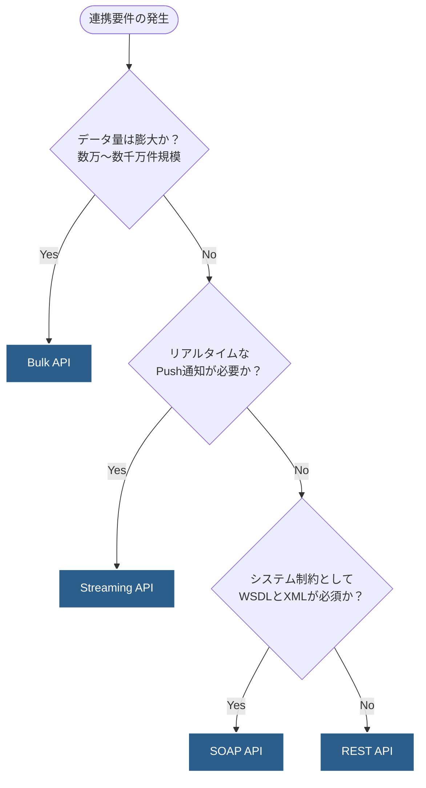

# 01｜API選定の判断フロー

## 概要
データ連携の要件（データ量、リアルタイム性、システム制約など）に基づいて、Salesforceが提供する最適なAPI（REST, SOAP, Bulk, Streaming）を決定するためのフローチャートおよび判断基準。

## 判断フローチャート (Decision Tree)

## 各APIの選定基準と理由

### 1. 【Bulk API】を選ぶべきケース
- **主な要件**: 初期データ移行、夜間バッチ、数万件以上のデータ同期。
- **判断理由**: 大量のデータを非同期かつ並列で処理することに設計面・ガバナ制限面で特化しているため。RESTでループ処理するよりもAPIリミットを大幅に節約できる。

### 2. 【Streaming API】を選ぶべきケース
- **主な要件**: レコード変更の即時UI反映（コールセンター等）、他システムへの即時イベント通知。
- **判断理由**: 定期的なポーリング（問い合わせ）によるAPIの無駄遣いを防ぎ、Salesforce側からの「Push通信」でリアルタイムにイベントを受け取れるため。

### 3. 【SOAP API】を選ぶべきケース
- **主な要件**: 古い基幹システム（ERP/レガシーシステム）との連携、強固な型保証が必要なエンタープライズ統合。
- **判断理由**: WSDLファイルに基づく厳密なインターフェース定義（型や必須項目）が事前に連携先でコンパイル可能であり、仕様変更に対する堅牢性が高いため。

### 4. 【REST API】を選ぶべきケース（デフォルトの選択肢）
- **主な要件**: Web・モバイルアプリからの単一または少数のレコード操作、その他の標準的な連携要件。
- **判断理由**: JSONフォーマットによる軽量な通信が可能で、SOAPに比べてオーバーヘッドが少ないため。現在のモダンなシステム連携において、**最も標準的かつ推奨される選択肢**。
