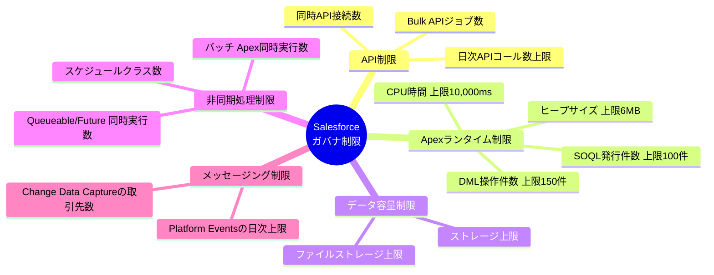

# 01｜Salesforceガバナ制限の種類と全体像

> **一言で言うと**: Salesforceは「マルチテナント」構造のため、1つの組織が使いすぎないよう上限（ガバナ制限）が設けられている。設計前に「どの種類の制限が自分の要件に関係するか」を把握しておくことが必須。

---

## 🏗️ なぜガバナ制限が存在するのか

Salesforceは複数の顧客（組織）が同じサーバーを共有する「**マルチテナントアーキテクチャ**」で動いている。
1つの組織が大量のリソースを消費すると、他の組織のパフォーマンスに影響が出る。
そのため、各トランザクション・実行単位に「上限」を定めることで公平なリソース配分を保っている。

```
全クライアントが同じインフラを共有
┌──────────────┬──────────────┬──────────────┐
│  組織A       │  組織B       │  組織C       │
│  (顧客1)     │  (顧客2)     │  (顧客3)     │
└──────────────┴──────────────┴──────────────┘
            ↕             ↕             ↕
      ┌─────────────────────────────────┐
      │       Salesforceインフラ        │
      │  （DB・Apexエンジン・APIなど）   │
      └─────────────────────────────────┘
```

---

## 🗂️ ガバナ制限の種類マップ（全体像）

Salesforceのガバナ制限は大きく**5つのカテゴリ**に分類される。



---

## 📋 カテゴリ別の制限一覧

### 1. API 制限（API Limits）

外部システムとの**データ連携設計において最も重要**な制限カテゴリ。

| 制限内容 | 目安 | 補足 |
|:---|:---:|:---|
| **日次APIコール数** | 組織のライセンス数×1,000 など | 全APIコール（REST/SOAP/Bulk）の合計。超過するとエラー |
| **Bulk APIジョブ同時実行** | 最大5つ | 同時に並行して走らせられるBulkジョブ数 |
| **Streaming APIクライアント** | 最大2,000接続 | CometD接続数の上限 |
| **コールアウト（外部HTTPコール）** | 1トランザクションで最大100回 | Apexから外部APIを叩く回数 |

> ⚠️ **設計の注意点**: 日次APIコール数は 全連携・全自動化フロー で消費される。構築前に試算を行い、設計書に明記する。

---

### 2. Apex ランタイム制限（Per-Transaction Limits）

**1回のトランザクション（処理の塊）** の中で使えるリソースの上限。

| 制限内容 | 上限 | 影響するシーン |
|:---|:---:|:---|
| **SOQL クエリ発行数** | 100回 | ループ内でSOQLを叩く「SOQL in loop」パターンで超過しやすい |
| **DML 操作件数** | 150回 | insert/update/delete などの書き込み操作の合計回数 |
| **DML 処理レコード数** | 10,000件 | 1回のトランザクションで操作できるレコードの件数 |
| **CPU 時間** | 10,000ms | 計算・変換処理が重い場合に超過 |
| **ヒープサイズ** | 6MB | 変数やコレクションで使用するメモリ上限 |
| **コールアウト数** | 100回 | 1トランザクションで外部APIを呼べる回数 |

> ⚠️ **設計の注意点**: トリガー → Apexクラス呼び出し → 外部API → DMLという複合処理はすぐにCPU/DMLの上限に近づく。1トランザクションで完結させる処理範囲を最初に設計で決めておく。

---

### 3. データ容量制限（Storage Limits）

| 制限内容 | 目安 | 補足 |
|:---|:---:|:---|
| **レコードストレージ** | ライセンスに応じた上限 | 標準・カスタムオブジェクトのデータ量の合計 |
| **ファイルストレージ** | ライセンスに応じた上限 | 添付ファイル、ContentDocument などのファイル容量 |

> ⚠️ **設計の注意点**: 大量データの連携（ETL/Bulk API）では、データ移行先の残余容量を設計前に確認する。

---

### 4. 非同期処理制限（Async Processing Limits）

バックグラウンドで動かす処理の制限。バッチ処理・スケジュール実行に関わる設計で重要。

| 処理種別 | 制限内容 | 上限目安 |
|:---|:---|:---:|
| **Batch Apex** | 同時実行ジョブ数 | 5ジョブ |
| **Future メソッド** | 1トランザクションで呼び出せる数 | 50回 |
| **Queueable Apex** | キューへの追加可能数 | 1トランザクションで最大1件 |
| **スケジュールクラス** | 登録できるスケジュール数 | 最大100件 |

---

### 5. メッセージング・イベント制限（Messaging / Streaming Limits）

イベント駆動設計（Platform Events・CDC）に関わる制限。

| 制限内容 | 上限目安 | 補足 |
|:---|:---:|:---|
| **Platform Events 日次配信上限** | ライセンスにより異なる | 超過するとイベントが配信されなくなる |
| **Change Data Capture 対象オブジェクト数** | 最大5オブジェクト（Standard Edition） | 変更を購読できるオブジェクトの数 |
| **イベントの保持期間** | 最大72時間 | 購読者がオフラインの間にイベントが届いていた場合の保持期限 |

---

## ✅ 設計前チェックリスト（ガバナ制限観点）

- [ ] **日次APIコール数の試算**: 想定する連携の頻度・件数から、1日のAPI消費量を計算したか？
- [ ] **SOQL in loop のチェック**: トリガー・バッチ処理でループ内でSOQLを発行していないか？
- [ ] **データ容量の確認**: 連携後のレコードストレージ使用量が上限に近づかないか確認したか？
- [ ] **Bulk API の活用**: 10,000件を超える大量データはBulk APIに切り替えているか？
- [ ] **イベント上限の試算**: Platform Events / CDC を使う場合、日次配信上限を超えるシーンを想定しているか？
