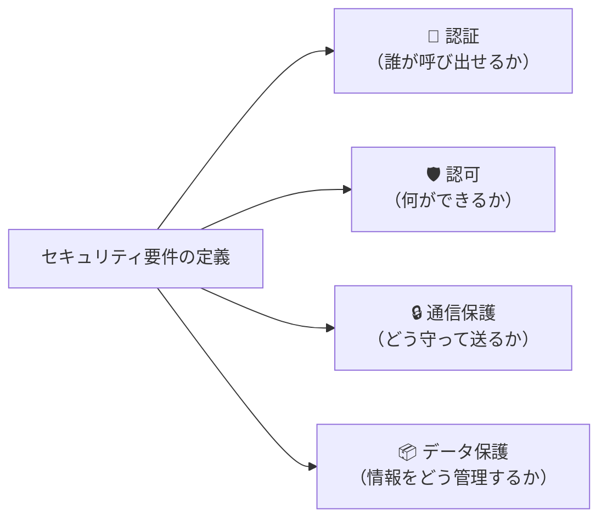
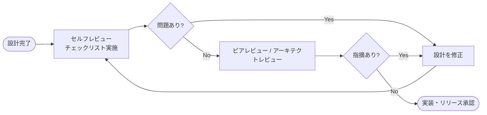

# 02｜セキュリティ要件の定義方法とレビュー手法

> **一言で言うと**: 「セキュリティは実装してから考える」では手遅れ。要件定義フェーズで先手を打ち、レビューで穴を塞ぐ。この2ステップを標準化する。

---

## 📋 ステップ1：セキュリティ要件の定義方法

セキュリティ要件は、システム間連携を設計する際に**4つの視点（認証・認可・通信・データ保護）**で必ず洗い出す。

### 要件定義の4視点フレームワーク



---

### 視点① 認証（Authentication）

**「呼び出し元は本当に信頼できるシステムか？」**を確認する仕組み。

| 確認項目 | 良い例 | 悪い例 |
|:---|:---|:---|
| 認証方式 | OAuth 2.0 (Client Credentials / JWT) | 固定パスワードをURLパラメータに含める |
| 認証情報の保管 | Named Credentials（Salesforce管理） | Apexコード内にハードコーディング |
| トークン有効期限 | アクセストークンの有効期限を設定 | 無期限のAPIキーを使い回す |

→ 選定基準の詳細は [[01_認証方式とOAuth2.0フロー統一]] を参照

---

### 視点② 認可（Authorization）

**「そのシステム・ユーザーに必要最小限の権限しか与えていないか？」**を確認する仕組み。

| 確認項目 | チェック内容 |
|:---|:---|
| **最小権限の原則** | 連携サービスには必要なオブジェクト・項目への権限のみを付与しているか |
| **スコープの限定** | OAuth接続アプリの認可スコープを最小限（`api`, `refresh_token`のみなど）に絞っているか |
| **統合ユーザーの分離** | 連携用の専用APIユーザー（インテグレーションユーザー）を作成し、一般ユーザーと分離しているか |

---

### 視点③ 通信保護（Transport Security）

**「データが経路上で盗聴・改ざんされないか？」**を担保する仕組み。

| 確認項目 | チェック内容 |
|:---|:---|
| **TLS強制** | すべての外部通信がHTTPS（TLS 1.2以上）で行われているか |
| **IPホワイトリスト** | 接続元のIPアドレスを制限しているか（可能な場合） |
| **証明書検証** | 外部システムのSSL証明書を検証しているか（自己署名証明書を安易に許可していないか） |

---

### 視点④ データ保護（Data Protection）

**「機密情報が漏洩・過剰共有されないか？」**を担保する仕組み。

| 確認項目 | チェック内容 |
|:---|:---|
| **転送データの最小化** | 連携時に個人情報・機密情報を不必要に含めていないか（必要な項目のみ送信） |
| **ログのマスキング** | 通信ログ・エラーログにトークンや個人情報が出力されていないか |
| **Secret管理** | APIキー・シークレットはSalesforceのカスタム設定や外部のSecret管理ツールを使用しているか |

---

## 🔍 ステップ2：セキュリティレビューの方法

要件定義・実装完了後、**2段階のレビュー**で漏れを検出する。

### レビュー全体フロー



---

### セルフレビュー用チェックリスト

設計者本人が実施する1次レビュー。すべてのチェックが✅になるまで次に進まない。

#### 認証・認可
- [ ] 認証方式はOAuth 2.0（Client Credentials または JWT）を採用しているか？
- [ ] 認証情報はNamed Credentialsを使い、コードに直書きしていないか？
- [ ] 連携用に専用のIntegrationユーザーを作成し、権限を最小化しているか？
- [ ] OAuthスコープは必要最小限（`api`スコープのみなど）に絞っているか？

#### 通信
- [ ] 全通信がHTTPS（TLS 1.2以上）で行われているか？
- [ ] 外部APIの証明書検証を無効（`All Users, no validation`）にしていないか？

#### データ保護
- [ ] エラーログ・デバッグログにAPIトークンや個人情報が出力されないか？
- [ ] 連携対象の項目に個人情報・機密情報が含まれる場合、必要性を確認したか？

---

### アーキテクト視点のピアレビューポイント

技術リーダー・アーキテクトが確認する2次レビュー。設計の構造的問題を指摘する。

| レビュー項目 | 確認観点 |
|:---|:---|
| **認証の一貫性** | プロジェクト内のすべての外部連携で認証方式が統一されているか？ |
| **認証情報の集中管理** | Named Credentials が適切に整理・命名されているか？ |
| **トークンリフレッシュ設計** | バッチ・スケジュール処理でトークン期限切れを考慮した設計になっているか？ |
| **インシデント対応設計** | 認証情報が漏洩した際に、すぐにトークンを無効化・ローテーションできるか？ |
| **ログ監査** | 不正アクセスを検知できる監査ログが有効になっているか？ |

---

## 📄 セキュリティ要件の記述テンプレート

設計書・仕様書の「セキュリティ要件」欄に記載する際の雛形。

```
## セキュリティ要件

### 認証方式
- 方式: OAuth 2.0 - Client Credentials Flow
- 認証情報の管理: Named Credentials（名称: [NC名を記載]）
- トークン有効期限: xx分

### 認可（権限設計）
- 使用ユーザー: [統合ユーザー名] （専用インテグレーションユーザー）
- 付与権限: [必要な権限を列挙]
- OAuthスコープ: api / refresh_token

### 通信保護
- 通信方式: HTTPS (TLS 1.2以上)
- IPホワイトリスト: [ある場合は記載]

### データ保護
- 個人情報の取扱: [含む / 含まない。含む場合は必要性を明記]
- ログマスキング: [対象フィールドと方式]
```
