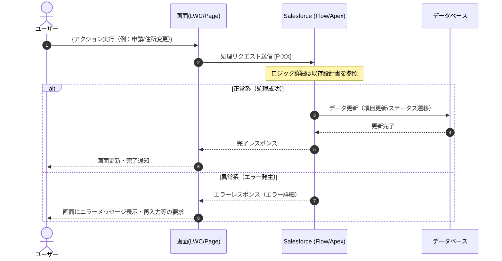
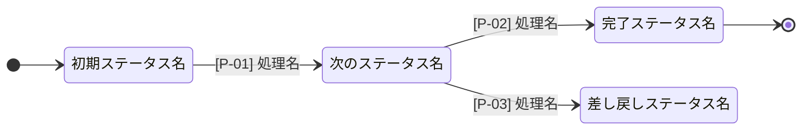

# 【テンプレート】業務プロセス設計・内部処理定義書（シーケンス・状態遷移・IDインデックス連結型）

> **このファイルの使い方**: このファイルを複製し（ファイル名例: `業務名_業務処理設計書.md`）、各セクションの `{...}` 部分を対象業務に合わせて書き換える。

---

## 1. 設計の背景と狙い

### 本ドキュメントの目的
- **業務とシステムの認識ギャップを解消する**
  従来の業務フロー図（スイムレーン図）では可視化が困難だった
  Salesforce内部の動作（自動処理の連鎖・データ状態変化・エラーハンドリング等）を、
  ユーザーのアクションと地続きに整理することで、認識のズレを根本から防ぐ。

- **属人化を防ぎ、仕様の組織的共有を実現する**
  特定の担当者だけが仕様を把握している状態を解消し、
  チーム全体が「システム的に何が起きているか」を正確に理解できる状態を目指す。

- **開発・保守・引継ぎの現場で、仕様把握にかかるコストを最小化する**
  本ドキュメントを参照することで、口頭説明や過去のSlack・メール調査に頼らずとも、
  処理の全容を最短かつ正確に把握できることを狙いとする。

### 複数手法を統合したハイブリッド構成

本ドキュメントは、以下の4つの要素を「処理ID `[P-XX]`」で連結した統合形式である。

1. **ユースケース記述のエッセンス**: 「事前条件」「事後条件」「例外ケース」の構造によりビジネスルールを明確化。
2. **システムシーケンス図 (SSD)**: ユーザー操作 → UI反応 → システム処理の時系列（システム挙動）を可視化。
    - **【一言で言うと】**: 「いつ、何が、どこで、どの順番で起きるか」という**一連の動作の流れ**を時系列で表す。
3. **状態遷移図 (State Transition Diagram)**: データの正解（ライフサイクル）とビジネス上の禁止遷移を定義。
    - **【一言で言うと】**: 「データが今どんな状態で、次は何になれるか」という**データの生涯（ステータス）**を表す。
4. **処理インデックス（自動化マップ）**: 全ての挙動と外部設計書へのハブとして情報を集約。シーケンス図（いつ動くか）と状態遷移図（何が変わるか）をIDで紐付け、詳細な仕様書（既存資料等）への入り口とする。

これらを統合することで、「業務（人の動き）」と「システム（データの動き）」のギャップを解消する。

---

## 2. 記入方針

- **処理IDの採番**: `[P-XX]` の形式で連番を付与する（例: P-01, P-02...）。データ更新のみの処理（ステータス不変）にもIDを付与し、可視化を維持する。
- **各図への記述の住み分け**:
    - **シーケンス図**: 処理のタイミング・メッセージの往復・ロジックの連鎖（「いつ・何が動くか」）を定義する。
    - **状態遷移図**: 業務フェーズの変化（ステータスの変更）のみを記述する。住所更新などの「項目変更のみ」の処理は記載せず、図の肥大化を防ぐ。
    - **処理インデックステーブル**: ステータス変化の有無に関わらず、全処理を漏れなくここに記載する。
- **二重管理の禁止**: 詳細なロジック（If文・計算式・項目マッピング等）は既存の個別設計書に委ね、本ドキュメントは「参照先のハブ」に徹する。
- **整合性**: ステータスが変わる処理は、シーケンス図・状態遷移図・インデックステーブルの**3箇所すべて**に記載する。

---

## 3. 業務シナリオ（ユースケース）

> **記入ガイド**: システム寄りの専門用語は避け、業務担当者が読んで「やりたいことの流れ」を理解できる一般用語・業務の粒度で記述する。

### ユースケース記述

- **ユースケース名**: {例：商談のクローズ（受注）処理}
- **アクター**: {例：営業担当者メイン、営業マネージャー}
- **事前条件**: {例：商談フェーズが「提案中」以降であり、有効な見積書が紐付いていること}

### メインフロー
1. {アクター} は、{〇〇画面} から {アクション: 例: 「受注確定」ボタンをクリック} する。
2. システムは、{必要な入力フォーム・確認画面} を表示する。
3. {アクター} は、{必要事項: 例: 受注日、受注金額など} を入力し、確定する。
4. システムは、入力内容を検証のうえ、該当レコードの {例: ステータス等} を更新する。
5. システムは、処理結果を画面に表示し、{アクター} に完了を通知する。

### 事後条件
- {例：商談フェーズが「クローズ処理済」に変更されていること}
- {例：入力された受注金額が正しくレコードに反映し、売上データが生成されていること}

### 例外ケース
- **{例外条件: 例: 必須項目が未入力の場合}**
  - システムは、エラーメッセージ「〇〇を入力してください」を表示し、処理を中断して再入力を促す。
- **{例外条件: 例: 与信限度額を超過している場合}**
  - システムは、即時受注とせずステータスを「特例承認待ち」とし、営業マネージャーへの承認プロセスに移行する。

---

## 4. システムシーケンス図

> **記入ガイド**: 対象業務の処理フローに合わせて書き換える。ノードの名称は業務用語（例：「申請登録画面」「承認フロー」）に変更する。処理の識別として各ステップに `[P-XX]` を付与する。

<!-- 👇 ここから対象業務の処理フローに書き換えてください -->

<!-- 👆 ここまで書き換え -->

---

## 5. 状態遷移図

> **記入ガイド**: ステータス項目の名称（例：「未申請」「承認待ち」）は対象業務に合わせて変更する。ステータスが変わらない処理（項目変更のみ）はここには記述せず、6章のインデックステーブルで管理する。

<!-- 👇 ここから対象業務のステータスに書き換えてください -->

<!-- 👆 ここまで書き換え -->

---

## 6. 処理インデックス仕様（連結・参照テーブル）

> **記入ガイド**: ステータス変化のある処理もない処理も、すべての処理をここに記載する。「詳細ロジック参照先」には既存の設計書・フロー定義書の章番号やリンクを記入する。

<!-- 👇 行を対象業務の処理に合わせて追記・修正してください -->
| 処理ID | 処理名 | 対象オブジェクト | トリガー種別 | 状態遷移 (From → To) | 詳細ロジック参照先 | 更新項目・備考 | エラー発生条件 | エラー内容 | ハンドリング方法 |
| :--- | :--- | :--- | :--- | :--- | :--- | :--- | :--- | :--- | :--- |
| **P-01** | {処理名} | {例: Opportunity} | 画面操作 | {From} → **{To}** | [フロー定義書A] 第X章 | {更新される項目、備考など} | {例: 必須項目が未入力} | {例: バリデーションエラー} | {例: 画面にエラーメッセージ表示} |
| **P-02** | {処理名} | {例: Task} | レコード更新トリガ | {From} → **{To}** | [個別設計書B] X.X項 | {更新される項目、備考など} | {例: DMLエラー発生時} | {例: フロー実行エラー} | {例: エラーログ記録・管理者にSlack通知} |
| **P-03** | {処理名} | {例: Contact} | バッチ/スケジュール | **（変更なし）** | [既存フローC] | {更新される項目、備考など} | {例: API制限超過} | {例: コールアウトエラー} | {例: 処理をスキップ・翌日に再実行} |
<!-- 👆 ここまで修正 -->

---