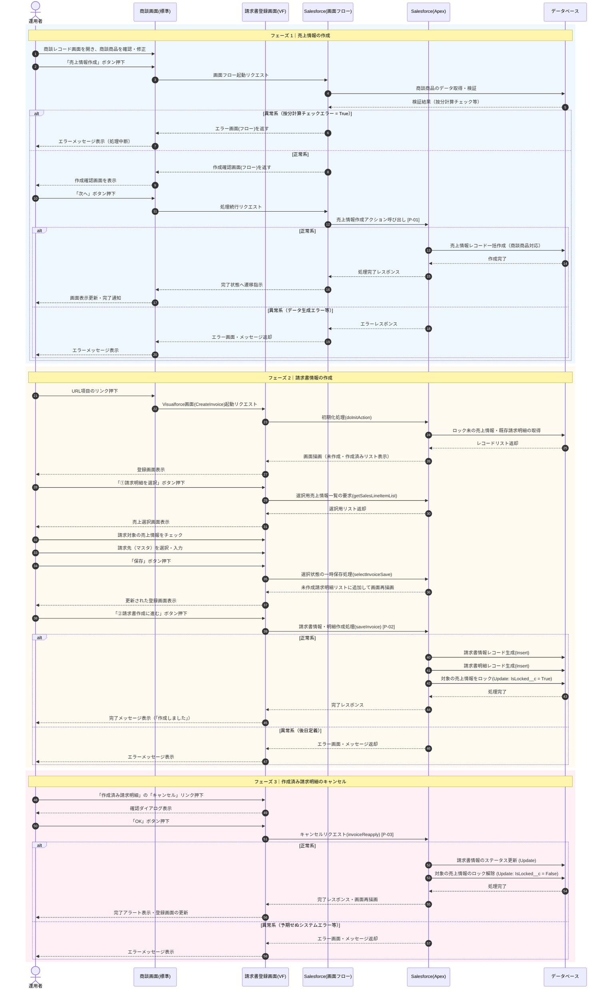

# 02｜システムシーケンス図

> [🔙 INDEX](./00_INDEX.md)

## 1. シーケンス定義

> **記入ガイド**: 対象業務の処理フローに合わせて書き換える。ノードの名称は業務用語（例：「請求書作成画面」「請求エンジン」）に変更する。処理の識別として各ステップに `[P-XX]` を付与する。

```mermaid
sequenceDiagram
    autonumber
    actor User as 運用者
    participant UI_Opp as 商談画面(標準)
    participant UI_VF as 請求書登録画面(VF)
    participant Flow as Salesforce(画面フロー)
    participant Apex as Salesforce(Apex)
    participant DB as データベース

    rect rgb(240, 248, 255)
    Note over User, DB: フェーズ 1｜売上情報の作成
    User->>UI_Opp: 商談レコード画面を開き、商談商品を確認・修正
    User->>UI_Opp: 「売上情報作成」ボタン押下
    UI_Opp->>Flow: 画面フロー起動リクエスト
    Flow->>DB: 商談商品のデータ取得・検証
    DB-->>Flow: 検証結果（按分計算チェック等）
    
    alt 異常系（按分計算チェックエラー = True）
        Flow-->>UI_Opp: エラー画面(フロー)を返す
        UI_Opp-->>User: エラーメッセージ表示（処理中断）
    else 正常系
        Flow-->>UI_Opp: 作成確認画面(フロー)を返す
        UI_Opp-->>User: 作成確認画面を表示
        
        User->>UI_Opp: 「次へ」ボタン押下
        UI_Opp->>Flow: 処理続行リクエスト
        Flow->>Apex: 売上情報作成アクション呼び出し [P-01]
        
        alt 正常系
            Apex->>DB: 売上情報レコード一括作成（商談商品対応）
            DB-->>Apex: 作成完了
            Apex-->>Flow: 処理完了レスポンス
            Flow-->>UI_Opp: 完了状態へ遷移指示
            UI_Opp-->>User: 画面表示更新・完了通知
        else 異常系（データ生成エラー等）
            Apex-->>Flow: エラーレスポンス
            Flow-->>UI_Opp: エラー画面・メッセージ返却
            UI_Opp-->>User: エラーメッセージ表示
        end
    end
    end

    rect rgb(255, 250, 240)
    Note over User, DB: フェーズ 2｜請求書情報の作成
    User->>UI_Opp: URL項目のリンク押下
    UI_Opp->>UI_VF: Visualforce画面(CreateInvoice)起動リクエスト
    UI_VF->>Apex: 初期化処理(doInitAction)
    Apex->>DB: ロック未の売上情報・既存請求明細の取得
    DB-->>Apex: レコードリスト返却
    Apex-->>UI_VF: 画面描画（未作成・作成済みリスト表示）
    UI_VF-->>User: 登録画面表示
    
    User->>UI_VF: 「①請求明細を選択」ボタン押下
    UI_VF->>Apex: 選択用売上情報一覧の要求(getSalesLineItemList)
    Apex-->>UI_VF: 選択用リスト返却
    UI_VF-->>User: 売上選択画面表示
    
    User->>UI_VF: 請求対象の売上情報をチェック
    User->>UI_VF: 請求先（マスタ）を選択・入力
    User->>UI_VF: 「保存」ボタン押下
    UI_VF->>Apex: 選択状態の一時保存処理(selectInvoiceSave)
    Apex-->>UI_VF: 未作成請求明細リストに追加して画面再描画
    UI_VF-->>User: 更新された登録画面表示
    
    User->>UI_VF: 「②請求書作成に進む」ボタン押下
    UI_VF->>Apex: 請求書情報・明細作成処理(saveInvoice) [P-02]
    
    alt 正常系
        Apex->>DB: 請求書情報レコード生成(Insert)
        Apex->>DB: 請求書明細レコード生成(Insert)
        Apex->>DB: 対象の売上情報をロック(Update: IsLocked__c = True)
        DB-->>Apex: 処理完了
        Apex-->>UI_VF: 完了レスポンス
        UI_VF-->>User: 完了メッセージ表示（「作成しました」）
    else 異常系（後日定義）
        Apex-->>UI_VF: エラー画面・メッセージ返却
        UI_VF-->>User: エラーメッセージ表示
    end
    end

    rect rgb(255, 240, 245)
    Note over User, DB: フェーズ 3｜作成済み請求明細のキャンセル
    User->>UI_VF: 「作成済み請求明細」の「キャンセル」リンク押下
    UI_VF-->>User: 確認ダイアログ表示
    
    User->>UI_VF: 「OK」ボタン押下
    UI_VF->>Apex: キャンセルリクエスト(invoiceReapply) [P-03]
    
    alt 正常系
        Apex->>DB: 請求書情報のステータス更新 (Update)
        Apex->>DB: 対象の売上情報のロック解除 (Update: IsLocked__c = False)
        DB-->>Apex: 処理完了
        Apex-->>UI_VF: 完了レスポンス・画面再描画
        UI_VF-->>User: 完了アラート表示・登録画面の更新
    else 異常系（予期せぬシステムエラー等）
        Apex-->>UI_VF: エラー画面・メッセージ返却
        UI_VF-->>User: エラーメッセージ表示
    end
    end
```

---
