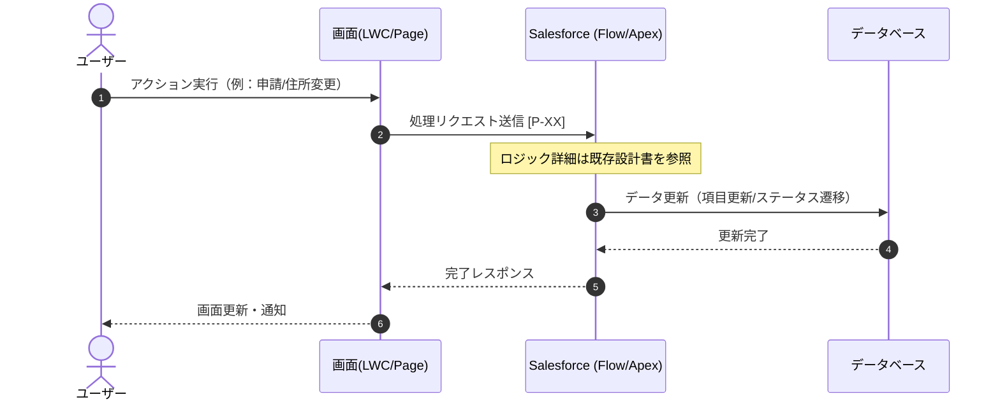
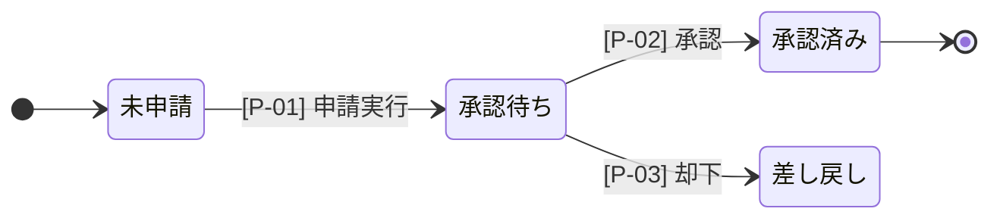

# 【最終版】局地業務設計・データ整合性定義書テンプレート（ID連結・参照型）

## 1. 設計（全体方針）
本ドキュメントは、特定の局地業務における「システム生理（シーケンス）」と「データの正解（状態遷移）」を、共通の **[処理ID]** で連結し、既存の「フロー定義書」「個別開発設計書」へのハブとして機能させる。

- **シーケンス図**: 処理のタイミング、メッセージの往復、および局地的なロジックの流れを定義。
- **状態遷移図**: 1つのオブジェクトにおける主要ステータス項目のライフサイクルと、ビジネス上の禁止遷移を定義。
- **処理インデックス**: 各図面を連結し、詳細ロジックの外部参照先および「項目レベルの更新内容」を整理。

---

## 2. システムシーケンス図 (Sequence Diagram)
※局地的な処理の流れを時系列で定義。データ更新のみの処理（ステータス不変）にも `[P-XX]` を付与して可視化する。

---

## 3. 状態遷移図 (State Transition Diagram)
※「業務フェーズ」の変化のみを記述。住所更新などの項目変更（ステータス不変）は、図の肥大化を防ぐため、ここには記述しない。

---

## 4. 処理インデックス仕様（連結・参照テーブル）
※すべての挙動を集約。ステータス変化がない「細かい項目更新」もここで漏れなく定義する。

| 処理ID | 処理名 | 状態遷移 (From → To) | 詳細ロジック参照先 | 更新項目・備考 |
| :--- | :--- | :--- | :--- | :--- |
| **P-01** | 申請実行処理 | 未申請 → **承認待ち** | [フロー定義書A] 第1章 | ステータス更新、申請日セット |
| **P-02** | 承認処理 | 承認待ち → **承認済み** | [個別設計書B] 3.1項 | 最終承認者フラグ更新 |
| **P-05** | 連絡先情報更新 | **（変更なし）** | [個別設計書B] 5.0項 | **住所、電話番号の更新** |
| **P-06** | 備考欄メモ保存 | **（変更なし）** | [既存フローC] | 最終更新者メモの追記 |

---

## 5. 設計および記載のルール（三位一体の運用）
1. **IDの役割**: `[P-XX]` は、シーケンス図上の「いつ動くか」、状態遷移図上の「何を変えるか」、テーブル上の「詳細はどこか」を結びつける唯一の鍵とする。
2. **情報の住み分け**:
    - **状態遷移図**: 業務的な「フェーズの変化」に特化し、可読性を維持する。
    - **処理詳細テーブル**: 住所更新のような「項目レベルの更新」や、既存設計書へのリンクを管理する。
    - **個別設計書（外部）**: 具体的なIf文、計算式、項目マッピングの詳細を記述し、二重管理を避ける。
3. **整合性の担保**: 
    - ステータスが変わる処理は、必ず「遷移図」と「テーブル」の両方に記載する。
    - ステータスが変わらない項目更新は、「シーケンス図」と「テーブル」に記載し、遷移図からは除外する。
4. **ガード条件**: 状態遷移図で定義されていない「不正な状態遷移」は、バリデーションルール等でシステム的に防止することを必須とする。
